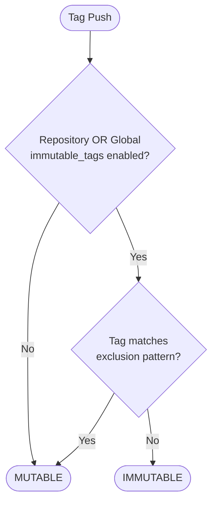

# Immutable Tags Configuration

Immutable tags prevent tag references from being overwritten once they have been pushed to the registry.
This feature helps ensure the integrity and reproducibility of container deployments by guaranteeing that a specific tag
always points to the same image digest.

## Overview

When immutable tags are enabled for a repository:
- Tags cannot be overwritten once pushed (returns 409 Conflict on overwrite attempts)
- Specific tags can be excluded from immutability using regex patterns
- The feature works seamlessly with pull-through caching
- Immutability status is only visible through 409 errors when attempting overwrites

## Configuration

Immutable tags can be configured at two levels:

### Global Configuration

Set default immutability for all repositories:

```toml
[global]
immutable_tags = true
immutable_tags_exclusions = ["^latest$", "^develop$", "^main$"]
```

### Repository-Specific Configuration

Override global settings for specific repositories:

```toml
[repository."myapp"]
immutable_tags = true
immutable_tags_exclusions = [
  "^latest$",           # Always allow 'latest' to be updated
  "^v\\d+\\.\\d+$",     # Allow minor version tags (e.g., v1.2)
  "^pr-\\d+$",          # Allow PR tags (e.g., pr-123)
  "^nightly-.*$",       # Allow nightly builds
  "^dev-.*$"            # Allow dev branches
]
```

## Behavior and Precedence

1. **Repository settings take precedence**: If a repository has `immutable_tags` configured, it overrides the global setting
2. **Exclusions are repository-specific**: If a repository has any `immutable_tags_exclusions`, only those patterns apply (global exclusions are not merged)
3. **Default behavior**: Without any configuration, tags are mutable (backward compatible)

### Configuration Logic

The effective immutability for a tag is determined as follows:



## Pull-Through Cache Optimization

When using immutable tags with pull-through caching, the registry optimizes upstream queries:

- **Immutable tags**: Once cached locally, the registry serves them directly without checking upstream
- **Mutable tags**: The registry automatically checks upstream for updates and refreshes the cache if the content has changed

## Examples

### Example 1: Production Registry

Protect all tags except latest:

```toml
[repository."production"]
immutable_tags = true
immutable_tags_exclusions = ["^latest$"]
```

### Example 2: Development Registry

Allow more flexibility for development while protecting release tags:

```toml
[repository."development"]
immutable_tags = true
immutable_tags_exclusions = [
  "^latest$",
  "^pr-\\d+$",
]
```

### Example 3: Mixed Environment

Different policies for different namespaces:

```toml
# Global default - protect everything
[global]
immutable_tags = true
immutable_tags_exclusions = ["^latest$"]

# Development namespace - more permissive
[repository."dev"]
immutable_tags = false  # All tags mutable

# Staging namespace - semi-protected
[repository."staging"]
immutable_tags = true
immutable_tags_exclusions = [
  "^latest$",
  "^staging-.*$",
  "^rc-.*$"
]

# Production namespace - highly protected
[repository."prod"]
immutable_tags = true
immutable_tags_exclusions = ["^latest$"]  # Only latest can be updated
```

## Error Handling

When attempting to overwrite an immutable tag, the registry returns:

- **HTTP Status**: 409 Conflict
- **Error Code**: TAG_IMMUTABLE
- **Error Message**: "Tag 'tagname' is immutable and cannot be overwritten"

Example with Docker CLI:
```bash
$ docker push registry.local/test/immutable:1.2.3
# The push refers to repository [registry.local/test/immutable]
# 171a26c7bc56: Layer already exists 
# 1.2.3: digest: sha256:7835e2f065209a69056cfe342bfe1d3effd9fff18cdf2a68ec87e9e9723a5614 size: 527

$ docker push registry.local/test/immutable:1.2.3                             
# The push refers to repository [registry.local/test/immutable]
# 81b3f4a69684: Layer already exists 
# unknown: Tag '1.2.3' is immutable and cannot be overwritten

```
