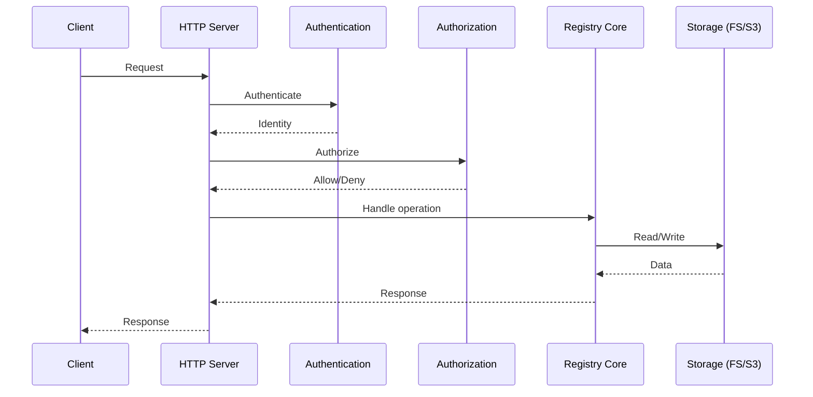
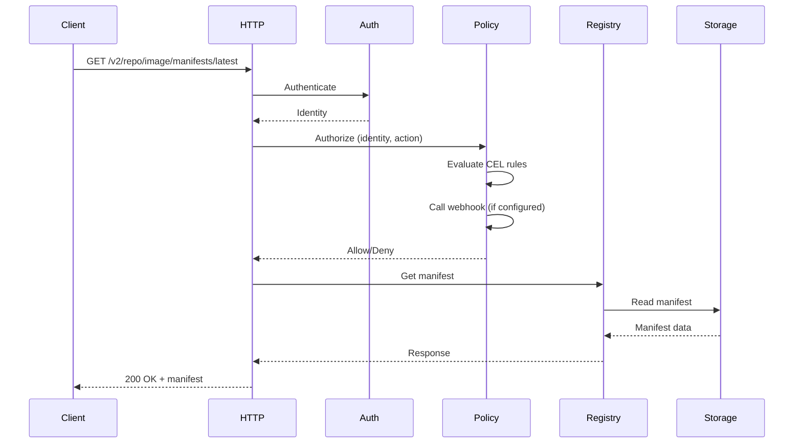

# Architecture Overview

Simple-Registry is an OCI-compliant container registry designed for resource efficiency, security, and operational simplicity.

## System Design



## Core Components

### HTTP Server

Built on Hyper for high-performance async I/O:
- HTTP/1.1 with connection pooling
- Optional TLS with automatic certificate reloading
- Configurable timeouts and concurrency limits

### Router

Parses incoming requests and maps them to operations:
- OCI Distribution Specification v1.1 endpoints
- Extension API endpoints (`/v2/_ext/`)
- Health and metrics endpoints
- Web UI routes

### Authentication Layer

Multiple authentication methods processed in order:
1. **mTLS**: Client certificate validation
2. **OIDC**: JWT token validation with JWKS
3. **Basic Auth**: Username/password with Argon2

Authentication is fail-open: invalid credentials try the next method.

### Authorization Layer

Two-stage authorization:
1. **CEL Policies**: Fast in-process evaluation
2. **Webhooks**: External authorization services

Both global and repository-specific policies are evaluated.

### Registry Core

Coordinates all registry operations:
- Manifest and blob management
- Tag handling
- Upload session management
- Referrer tracking

### Pull-Through Cache

Proxies requests to upstream registries:
- Transparent caching of manifests and blobs
- Background fetch and store
- Immutable tag optimization
- Fallback to multiple upstreams

### Storage Layer

Abstracted storage backends:
- **Blob Store**: Large binary content (layers, configs)
- **Metadata Store**: Manifests, tags, links

Both can use filesystem or S3, independently configured, but it usually makes sense to use
the same storage backend for both.

---

## Request Flow



With S3 storage, blob requests redirect to pre-signed URLs to avoid proxying data through the registry.

---

## Data Model

### Repository Structure

```
repository/
├── namespace/
│   ├── _manifests/
│   │   ├── tags/
│   │   │   └── latest/
│   │   │       └── link -> sha256:abc123
│   │   └── revisions/
│   │       └── sha256:abc123/
│   │           └── manifest.json
│   ├── _layers/
│   │   └── sha256:def456/
│   │       └── link -> blob
│   └── _uploads/
│       └── uuid/
│           └── data
└── _blobs/
    └── sha256:def456
```

### Content Addressing

All content is addressed by digest (SHA-256 or SHA-512):
- Manifests: `sha256:<hash>`
- Blobs: `sha256:<hash>`
- Tags: Symbolic links to manifest digests

---

## Configuration System

### Hot Reloading

Configuration file is watched for changes:
- Most settings reload without restart
- TLS certificates reload automatically
- Invalid configurations are rejected

### Immutable Settings

These require restart:
- Bind address and port
- TLS enable/disable
- Storage backend type changes

---

## Concurrency Model

### Async Runtime

Built on Tokio with configurable parallelism:
- `max_concurrent_requests`: HTTP request limit
- `max_concurrent_cache_jobs`: Background cache operations

### Locking

Distributed locking for multi-replica deployments:
- In-memory locks for single instance
- Redis locks for multiple instances

---

## Security Design

### Defense in Depth

Multiple security layers:
1. TLS encryption
2. Authentication (identity verification)
3. Authorization (permission checking)
4. Input validation (OCI compliance)

### Fail-Closed Authorization

- Webhooks fail-closed on timeout/error
- CEL policy errors skip the rule (logged)
- No authentication = no identity

### No Unsafe Code

```rust
#![forbid(unsafe_code)]
```

---

## Observability

### Logging

Structured logging with configurable levels:
- Module-specific filtering
- Performance-conscious defaults

### Metrics

Prometheus metrics for:
- HTTP requests (rate, latency, in-flight)
- Authentication attempts
- Webhook performance
- Storage operations

### Tracing

Optional OpenTelemetry integration:
- Distributed tracing support
- Configurable sampling rate

---

## Extension Points

### Webhooks

External authorization for:
- Custom business logic
- Integration with existing systems
- Complex policy evaluation

### CEL Policies

Embedded policy engine for:
- Fast evaluation
- No external dependencies
- Rich expression language

### Multiple OIDC Providers

Support for any number of identity providers:
- GitHub Actions
- Google, Okta, Auth0, Keycloak
- Custom OIDC providers
