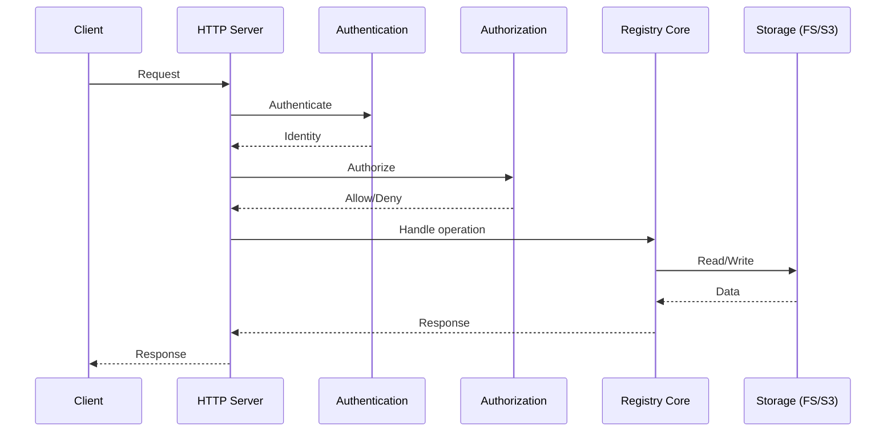
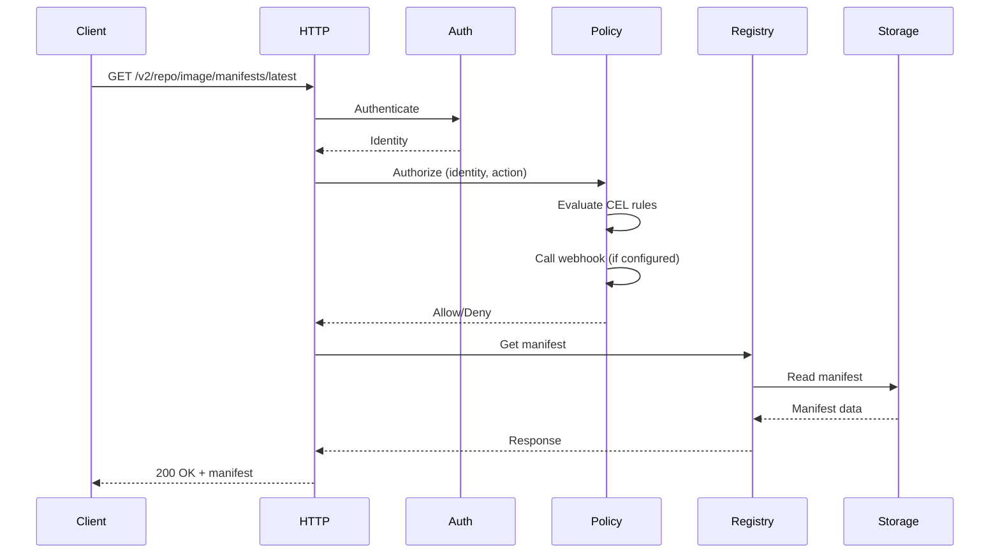

# Architecture Overview

Angos is an OCI-compliant container registry designed for resource efficiency, security, and operational simplicity.

## System Design


```mermaid
sequenceDiagram
    participant Client
    participant HTTP as HTTP Server
    participant Auth as Authentication
    participant Policy as Authorization
    participant Registry as Registry Core
    participant Storage as Storage (FS/S3)

    Client->>HTTP: Request
    HTTP->>Auth: Authenticate
    Auth-->>HTTP: Identity
    HTTP->>Policy: Authorize
    Policy-->>HTTP: Allow/Deny
    HTTP->>Registry: Handle operation
    Registry->>Storage: Read/Write
    Storage-->>Registry: Data
    Registry-->>HTTP: Response
    HTTP-->>Client: Response
```

## Core Components

### HTTP Server

Built on Hyper for high-performance async I/O:
- HTTP/1.1 with connection pooling
- Optional TLS with automatic certificate reloading
- Configurable timeouts and concurrency limits

### Router

Parses incoming requests and maps them to operations:
- OCI Distribution Specification v1.1 endpoints, plus two the specification added after it: the
  `digest-algorithm` upload parameter (end-4c) and the `ns` proxy parameter
- Extension API endpoints (`/v2/_angos/`)
- Health and metrics endpoints
- Web UI routes

### Authentication Layer

Multiple authentication methods processed in order:
1. **mTLS**: Client certificate validation
2. **OIDC**: JWT token validation with JWKS
3. **Basic Auth**: Username/password with Argon2

Missing credentials continue to the next method; invalid credentials fail the request.

### Authorization Layer

Two-stage authorization:
1. **CEL Policies**: Fast in-process evaluation
2. **Webhooks**: External authorization services

Both global and repository-specific policies are evaluated.

### Registry Core

Coordinates all registry operations:
- Manifest and blob management
- Tag handling
- Upload session management
- Referrer tracking

### Pull-Through Cache

Proxies requests to upstream registries:
- Transparent caching of manifests and blobs
- Background fetch and store
- Immutable tag optimization
- Fallback to multiple upstreams

### Replication

Mirrors local mutations *out* to downstream registries (the outbound counterpart of the pull-through cache):
- Per-repository downstream lists, event-driven on manifest push/delete
- Rides the durable job queue for retry, coalescing, and restart survival
- Loop prevention via receiver-side no-op suppression; last-writer-wins tag conflict resolution
- On-demand reconciliation via `angos replicate`

See [Bi-Directional Replication](replication.md) for the full model.

### Storage Layer

Abstracted storage backends:
- **Blob Store**: Large binary content (layers, configs, manifest bodies) and in-progress upload sessions
- **Metadata Store**: Manifest links, tags, blob-index reference keys

Both can use filesystem or S3, independently configured, but it usually makes sense to use
the same storage backend for both.

---

## Request Flow


```mermaid
sequenceDiagram
    participant Client
    participant HTTP
    participant Auth
    participant Policy
    participant Registry
    participant Storage

    Client->>HTTP: GET /v2/repo/image/manifests/latest
    HTTP->>Auth: Authenticate
    Auth-->>HTTP: Identity

    HTTP->>Policy: Authorize (identity, action)
    Policy->>Policy: Evaluate CEL rules
    Policy->>Policy: Call webhook (if configured)
    Policy-->>HTTP: Allow/Deny

    HTTP->>Registry: Get manifest
    Registry->>Storage: Read manifest
    Storage-->>Registry: Manifest data
    Registry-->>HTTP: Response
    HTTP-->>Client: 200 OK + manifest
```

With S3 storage, blob and manifest GET requests redirect to pre-signed URLs by default, avoiding proxying data through the registry.
This can be disabled per object kind with `enable_blob_redirect = false` and/or `enable_manifest_redirect = false` in `[global]`, in which case the registry proxies the corresponding responses.

**When redirects are enabled** (both flags default to `true`):
- Clients must have direct network access to the S3 endpoint
- Pre-signed URLs expire, so very slow downloads may fail
- S3 bucket policies must allow access from client IP ranges

A client that sends the `X-Angos-No-Redirect` request header is served the body inline regardless of the flags. The web UI sets it because a browser `fetch` cannot follow the cross-origin redirect to a pre-signed URL.

---

## Data Model

### Repository Structure

```
v2/
├── repositories/
│   └── {namespace}/
│       ├── _layers/
│       │   └── {algorithm}/
│       │       └── {hash}/
│       │           └── link
│       └── _uploads/
│           └── {uuid}/
│               ├── data
│               ├── startedat
│               └── hashstates/
├── blobs/
│   └── {algorithm}/
│       └── {hash_prefix}/
│           └── {hash}/
│               └── data
├── ref/
│   └── {algorithm}/
│       └── {hash_prefix}/
│           └── {hash}/
│               ├── {namespace}!own
│               └── {namespace}!r/
│                   └── {entry}
├── ns/
│   ├── {namespace}!tag/
│   │   └── {tag}!/
│   │       └── {ord}.{set|del}.{algorithm}.{hash}
│   ├── {namespace}!rev/
│   │   └── {algorithm}/
│   │       └── {hash_prefix}/
│   │           └── {hash}
│   ├── {namespace}!sub/
│   │   └── {algorithm}/
│   │       └── {hash_prefix}/
│   │           └── {hash}/
│   │               └── {r-algorithm}.{r-hash}
│   └── {namespace}!atime/
│       ├── tag/
│       │   └── {tag}
│       └── rev/
│           └── {algorithm}/
│               └── {hash}
└── cat/
    └── {namespace}!
```

The two stores split this tree by content: the blob store holds the blob `data` files and the `_uploads/` session directories, while the metadata store holds the rest of the `v2/repositories/` tree (links), the blob-index reference keys under `v2/ref/`, and the tag state under `v2/ns/`. Each reference key is an empty write-once object recording one link through which a namespace references the blob: `{namespace}!own` marks ownership (upload or mount), and each key under `{namespace}!r/` marks one referencing link.

A tag is an ordered set of write-once entries: `{ord}` inverts the author's unix-millisecond timestamp so a listing yields newest first, `set` entries record a push and `del` entries a deletion (still naming the digest the tag held), and the newest entry group decides the tag's current state. Writers only append, so concurrent pushes and replicas never contend; last-writer-wins is a property of the key names. The `!` terminator sorts below every character the name grammars admit, which keeps flat listings in true lexical order.

A stored manifest revision is one immutable record under `{namespace}!rev/`: its existence makes the digest resolvable and its body carries the media type and creation time. A referrer is one record per (subject, referrer) under `{namespace}!sub/`, whose body is the referring manifest's descriptor. Advisory last-pull timestamps live in their own overwritten keys under `{namespace}!atime/`, so none of the write-once shapes ever mutate, which is what makes them cacheable without staleness. `v2/cat/` holds one empty key per namespace, written once per namespace per process, so the catalog serves ordered pages straight off its listing; the `!` terminator lets nested repositories such as `a` and `a/b` coexist on FS.

Stores written by earlier versions may still hold per-namespace `refs/{namespace}.json` shards under `v2/blobs/` and per-tag `current/link`, revision, and referrer link files under `v2/repositories/`; all are read as a fallback and converted to the new shapes by scrub.

### Content Addressing

All content is addressed by digest (SHA-256 or SHA-512):
- Manifests: `sha256:<hash>` or `sha512:<hash>`
- Blobs: `sha256:<hash>` or `sha512:<hash>`
- Tags: ordered write-once entries recording the manifest digest per event

---

## Configuration System

### Hot Reloading

Configuration file is watched for changes:
- Most settings reload without restart
- TLS certificates reload automatically
- Invalid configurations are rejected

### Immutable Settings

These require restart:
- Bind address and port
- TLS enable/disable
- Storage backend type changes

---

## Concurrency Model

### Async Runtime

Built on Tokio with configurable parallelism:
- `max_concurrent_requests`: HTTP request limit
- `max_concurrent_cache_jobs`: Background cache operations

### Locking

Distributed locking for multi-replica deployments:
- In-memory locks for single instance
- Redis locks for multiple instances
- S3 locks for multiple instances using conditional writes (no extra infrastructure needed)

---

## Security Design

### Defense in Depth

Multiple security layers:
1. TLS encryption
2. Authentication (identity verification)
3. Authorization (permission checking)
4. Input validation (OCI compliance)

### Fail-Closed Authorization

- Webhooks fail-closed on timeout/error
- CEL policy evaluation errors and non-boolean results deny the request
- No authentication = no identity

### No Unsafe Code

```rust
#![forbid(unsafe_code)]
```

---

## Observability

### Logging

Structured logging with configurable levels:
- Module-specific filtering
- Performance-conscious defaults

### Metrics

Prometheus metrics for:
- HTTP requests (rate, latency, in-flight)
- Authentication attempts
- Webhook performance
- Storage operations

### Tracing

Optional OpenTelemetry integration:
- Distributed tracing support
- Configurable sampling rate

---

## Extension Points

### Webhooks

External authorization for:
- Custom business logic
- Integration with existing systems
- Complex policy evaluation

### CEL Policies

Embedded policy engine for:
- Fast evaluation
- No external dependencies
- Rich expression language

### Event Webhooks

Notify external systems on registry operations:
- Three delivery policies: `required` (blocks response), `optional` (best-effort), `async` (fire-and-forget)
- Scoped to specific repositories with regex filters
- HMAC-signed payloads when a token is configured

### Multiple OIDC Providers

Support for any number of identity providers:
- GitHub Actions
- Google, Okta, Auth0, Keycloak
- Custom OIDC providers
