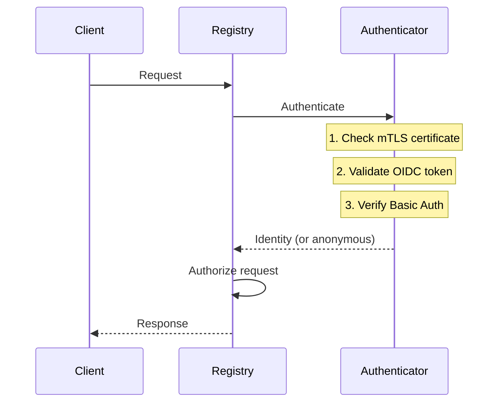
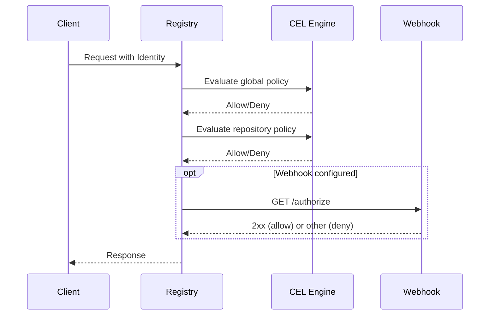
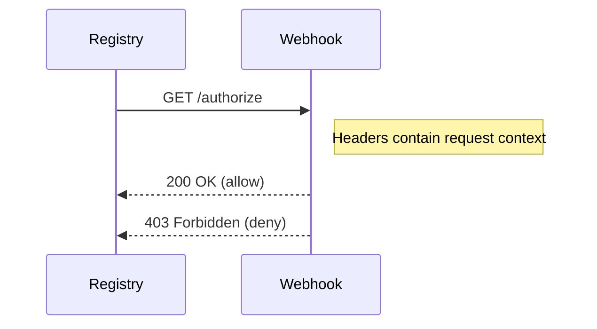

# Authentication and Authorization

Simple-Registry implements a layered security model with multiple authentication methods and flexible authorization policies.

## Authentication vs Authorization

| Aspect   | Authentication  | Authorization        |
|----------|-----------------|----------------------|
| Question | Who are you?    | What can you do?     |
| Input    | Credentials     | Identity + Request   |
| Output   | Identity        | Allow/Deny           |
| When     | First           | After authentication |

---

## Authentication Flow



### Processing Order

1. **mTLS**: Extract certificate information if present
2. **OIDC**: Validate Bearer tokens or OIDC-as-Basic-Auth
3. **Basic Auth**: Validate username/password from configuration

### Credential Handling

Each method handles missing vs invalid credentials differently:

| Method     | No Credentials | Invalid Credentials |
|------------|----------------|---------------------|
| mTLS       | Continue       | **TLS handshake fails** |
| OIDC       | Continue       | **Reject immediately** |
| Basic Auth | Continue       | Anonymous identity  |

This means:
- Missing credentials → try next method
- Invalid mTLS certificate → connection rejected at TLS layer
- Invalid OIDC token → immediate 401 (fail-closed)
- Invalid Basic Auth password → anonymous identity (fail-open)

---

## Authentication Methods

### mTLS (Client Certificates)

When a client presents a certificate:
1. Certificate chain is validated against `client_ca_bundle`
2. Common Names and Organizations are extracted
3. Information is available in policies

```toml
[server.tls]
server_certificate_bundle = "/tls/server.crt"
server_private_key = "/tls/server.key"
client_ca_bundle = "/tls/client-ca.crt"  # Enables mTLS
```

**Identity fields:**
- `identity.certificate.common_names`
- `identity.certificate.organizations`

### OIDC (JWT Tokens)

Tokens are validated by:
1. Signature verification using provider's JWKS
2. Issuer claim matching
3. Audience claim (if configured)
4. Time-based claims (exp, nbf)

```toml
[auth.oidc.github-actions]
provider = "github"

[auth.oidc.corporate]
provider = "generic"
issuer = "https://auth.example.com"
```

**Two ways to present tokens:**
- `Authorization: Bearer <token>` (standard OAuth2)
- Basic Auth with username = provider name, password = token (Docker compatibility)

**Identity fields:**
- `identity.oidc.provider_name`
- `identity.oidc.provider_type`
- `identity.oidc.claims["claim_name"]`

### Basic Auth (Password)

Username and password validated against configuration:

```toml
[auth.identity.alice]
username = "alice"
password = "$argon2id$v=19$m=19456,t=2,p=1$..."  # Argon2 hash
```

**Identity fields:**
- `identity.id` (e.g., "alice")
- `identity.username`

---

## Authorization Flow



### Policy Evaluation

**Global policy** runs first (if defined):
- Provides organization-wide baseline
- Can enforce minimum security standards

**Repository policy** runs second (if defined):
- Can add stricter rules
- Cannot override global denials

**Webhook** runs last (if configured):
- External authorization service
- For complex business logic

### CEL Policy Modes

**default_allow = false** (recommended):
- Deny unless a rule explicitly allows
- Rules act as "allow" rules: `true` → allow
- At least one rule must return `true` for access

**default_allow = true**:
- Allow unless a rule explicitly denies
- Rules act as "deny" rules: `true` → deny
- Any rule returning `true` denies access

---

## Identity Object

The identity object available in policies:

```javascript
identity = {
  id: "alice",                    // Config identity name
  username: "alice",              // Basic auth username
  client_ip: "192.168.1.100",     // Client IP address

  certificate: {                   // mTLS info
    common_names: ["client-1"],
    organizations: ["Engineering"]
  },

  oidc: {                          // OIDC info (null if not OIDC)
    provider_name: "github-actions",
    provider_type: "GitHub Actions",
    claims: {
      "repository": "org/repo",
      "ref": "refs/heads/main",
      "actor": "username",
      // ... all JWT claims
    }
  }
}
```

---

## Common Patterns

### Require Authentication

```toml
[global.access_policy]
default_allow = false
rules = ["identity.username != null"]
```

### Layer Multiple Methods

```toml
rules = [
  # Admin via basic auth
  "identity.username == 'admin'",

  # Platform team via certificate
  "identity.certificate.organizations.contains('Platform')",

  # CI/CD via OIDC
  '''identity.oidc != null &&
     identity.oidc.claims["repository"].startsWith("myorg/")'''
]
```

### Read/Write Separation

```toml
rules = [
  # Anyone can read
  "request.action.startsWith('get-')",

  # Only deployers can write
  "identity.username == 'deployer'"
]
```

---

## Webhook Integration

Webhooks enable external authorization:



**Headers sent:**
- Request context (method, URI, client IP)
- Registry context (action, namespace, reference)
- Identity context (username, certificate info)

**Response interpretation:**
- 2xx → Allow
- Any other status → Deny
- Timeout/error → Deny (fail-closed)

---

## Security Considerations

### Fail-Closed Design

- No policies = no access
- Webhook timeout = denied
- CEL evaluation error = rule skipped (continues evaluation)

### Token Validation

OIDC tokens are cryptographically verified:
- Signature against provider's JWKS
- Issuer must match configuration
- Expiration is enforced
- Clock skew tolerance is configurable

### Password Storage

- Argon2id hashing
- Interactive tool for hash generation
- Never stored in plaintext

### Certificate Validation

- Full chain validation
- Expiration checking
- CA trust anchoring
