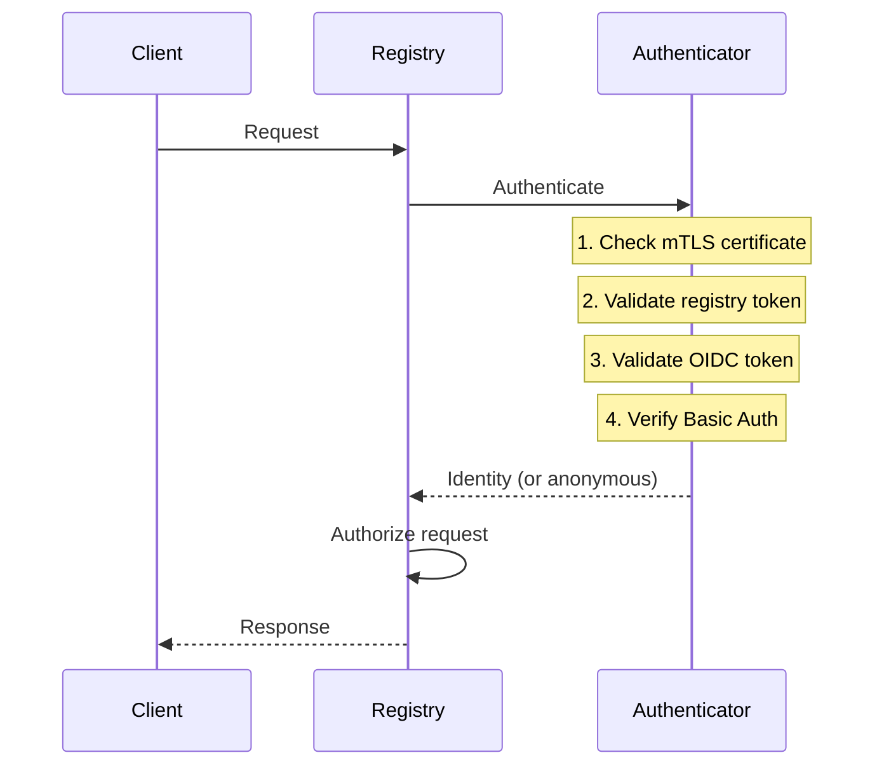
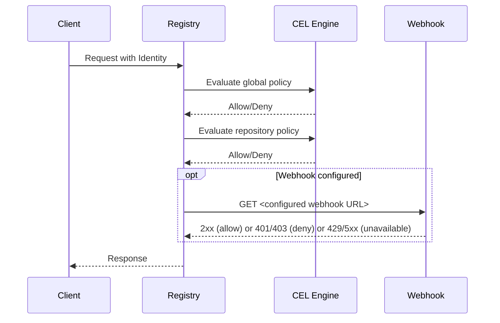
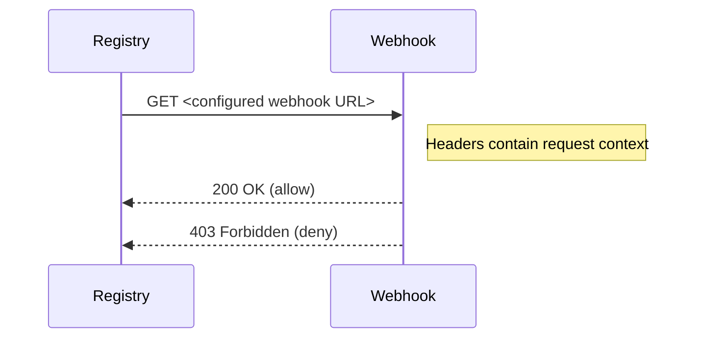

# Authentication and Authorization

Angos implements a layered security model with multiple authentication methods and flexible authorization policies.

## Authentication vs Authorization

| Aspect   | Authentication  | Authorization        |
|----------|-----------------|----------------------|
| Question | Who are you?    | What can you do?     |
| Input    | Credentials     | Identity + Request   |
| Output   | Identity        | Allow/Deny           |
| When     | First           | After authentication |

---

## Authentication Flow


```mermaid
sequenceDiagram
    participant Client
    participant Registry
    participant Auth as Authenticator

    Client->>Registry: Request
    Registry->>Auth: Authenticate

    Note over Auth: 1. Check mTLS certificate
    Note over Auth: 2. Validate registry token
    Note over Auth: 3. Validate OIDC token
    Note over Auth: 4. Verify Basic Auth

    Auth-->>Registry: Identity (or anonymous)
    Registry->>Registry: Authorize request
    Registry-->>Client: Response
```

### Processing Order

1. **mTLS**: Extract certificate information if present
2. **Registry token**: Validate a token this registry issued
3. **OIDC**: Validate Bearer tokens or OIDC-as-Basic-Auth
4. **Basic Auth**: Validate username/password from configuration

A valid registry token stops the chain: the OIDC middlewares claim any bearer
header and reject what they cannot validate, so they must not see one.

### Credential Handling

Each method handles missing vs invalid credentials differently:

| Method     | No Credentials | Invalid Credentials |
|------------|----------------|---------------------|
| mTLS       | Continue       | **TLS handshake fails** |
| Registry token | Continue   | **Reject immediately** |
| OIDC       | Continue       | **Reject immediately** |
| Basic Auth | Continue       | **Reject immediately** |

This means:
- Missing credentials → try next method
- Invalid mTLS certificate → connection rejected at TLS layer
- Invalid OIDC token → immediate 401 (fail-closed)
- Invalid Basic Auth password → immediate 401 (fail-closed)

---

## Authentication Methods

### mTLS (Client Certificates)

When a client presents a certificate:
1. Certificate chain is validated against `client_ca_bundle`
2. Common Names and Organizations are extracted
3. Information is available in policies

```toml
[server.tls]
server_certificate_bundle = "/tls/server.crt"
server_private_key = "/tls/server.key"
client_ca_bundle = "/tls/client-ca.crt"
# "optional": accept connections with or without a cert (default when client_ca_bundle is set).
# "required": reject connections that do not present a valid client cert at the TLS layer.
client_auth = "required"
```

See [Configure mTLS](../how-to/configure-mtls.md) for the full `client_auth` mode reference.

**Identity fields:**
- `identity.certificate.common_names`
- `identity.certificate.organizations`

### OIDC (JWT Tokens)

Tokens are validated by:
1. Signature verification using provider's JWKS
2. Issuer claim matching
3. Audience claim (if configured)
4. Time-based claims (exp, nbf)
5. Presence of every claim listed in `required_claims`

Providers differ only by configuration; there is no provider type to select.

```toml
[auth.oidc.github-actions]
issuer = "https://token.actions.githubusercontent.com"
required_claims = ["repository", "actor"]

[auth.oidc.corporate]
issuer = "https://auth.example.com"
```

**Two ways to present tokens:**
- `Authorization: Bearer <token>` (standard OAuth2)
- Basic Auth with username = provider name, password = token (Docker compatibility)

Authorization schemes are case-insensitive; for example, `bearer` and `Bearer` are equivalent.

**Identity fields:**
- `identity.oidc.provider_name`
- `identity.oidc.claims["claim_name"]`

### Basic Auth (Password)

Username and password validated against configuration:

```toml
[auth.identity.alice]
username = "alice"
password = "$argon2id$v=19$m=19456,t=2,p=1$..."  # Argon2 hash
```

**Identity fields:**
- `identity.id` (e.g., "alice")
- `identity.username`

### Registry Token

With [`auth.token_service`](../reference/configuration.md#token-service-authtoken_service) configured, `GET /token` exchanges whatever credential authenticated the request for a registry-signed bearer token, advertised through the `WWW-Authenticate` header of a 401. OCI clients drive this on their own. It exists so a credential that expires faster than a push takes, such as a GitHub Actions OIDC token, only has to be valid when the push starts.

The token carries `identity.id`, `identity.username` and `identity.oidc`, so policies decide exactly as they did for the original credential. It never carries `identity.certificate` or `identity.client_ip`: both are read from the live request, which keeps a certificate-bound identity from becoming a replayable bearer credential and lets mTLS compose with a token.

The identity is frozen, the permissions are not: policies, repository rules and webhooks are still evaluated per request against live configuration. The reverse also holds, and is the cost of the feature: a token outlives the credential it was minted from and cannot be revoked before `ttl_secs` elapses. Rotating `secret_key`, or removing the OIDC provider a token names, invalidates outstanding tokens.

---

## Authorization Flow


```mermaid
sequenceDiagram
    participant Client
    participant Registry
    participant Policy as CEL Engine
    participant Webhook

    Client->>Registry: Request with Identity

    Registry->>Policy: Evaluate global policy
    Policy-->>Registry: Allow/Deny

    Registry->>Policy: Evaluate repository policy
    Policy-->>Registry: Allow/Deny

    opt Webhook configured
        Registry->>Webhook: GET <configured webhook URL>
        Webhook-->>Registry: 2xx (allow) or 401/403 (deny) or 429/5xx (unavailable)
    end

    Registry-->>Client: Response
```

### Policy Evaluation

**Global policy** runs first (if defined):
- Provides organization-wide baseline
- Can enforce minimum security standards

**Repository policy** runs second (if defined):
- Can add stricter rules
- Cannot override global denials
- Applies only when the namespace matches a configured repository

Namespaces that do not match any configured repository have no repository policy
to evaluate, so the global policy decides them and the global webhook, if any,
gates them. A global rule tells the two cases apart with
`has_repository_policy()`, true only when a `[repository]` declaring its own
`access_policy` covers the request: granting on it admits exactly what that
repository policy then decides, and leaves every other namespace to the global
default.

**Webhook** runs last (if configured):
- External authorization service
- For complex business logic

### CEL Policy Modes

**default = "deny"** (recommended):
- Deny unless a rule explicitly allows
- Rules act as "allow" rules: `true` → allow
- At least one rule must return `true` for access

**default = "allow"**:
- Allow unless a rule explicitly denies
- Rules act as "deny" rules: `true` → deny
- Any rule returning `true` denies access

---

## Identity Object

The identity object available in policies:

```javascript
identity = {
  id: "alice",                    // Config identity name
  username: "alice",              // Basic auth username
  client_ip: "192.168.1.100",     // Client IP address

  certificate: {                   // mTLS info
    common_names: ["client-1"],
    organizations: ["Engineering"]
  },

  oidc: {                          // OIDC info (null if not OIDC)
    provider_name: "github-actions",
    claims: {
      "repository": "org/repo",
      "ref": "refs/heads/main",
      "actor": "username",
      // ... all JWT claims
    }
  }
}
```

---

## CEL Rule Evaluation

**Rule evaluation:** Rules are evaluated disjunctively (OR'd). The meaning depends on the mode:

- **`default = "deny"`** (default-deny): rules act as **allow** rules: access is granted if ANY rule returns true.
- **`default = "allow"`** (default-allow): rules act as **deny** rules: access is denied if ANY rule returns true.

Do not mix allow and deny logic in the same rules array: since rules are OR'd, a single matching rule determines the outcome.

---

## Common Patterns

### Require Authentication

```toml
[global.access_policy]
default = "deny"
rules = ["identity.username != null"]
```

### Layer Multiple Methods

```toml
rules = [
  # Admin via basic auth
  "identity.username == 'admin'",

  # Platform team via certificate
  "identity.certificate.organizations.contains('Platform')",

  # CI/CD via OIDC
  '''identity.oidc != null &&
     identity.oidc.claims["repository"].startsWith("myorg/")'''
]
```

### Read/Write Separation

```toml
rules = [
  # Anyone can pull images
  "request.action in ['get-manifest', 'get-blob']",

  # Only deployers can write
  "identity.username == 'deployer'"
]
```

:::warning
Do not use `request.action.startsWith('get-')` for anonymous access. This includes
`get-api-version`, which causes Docker to skip sending credentials on all requests.
:::

### Privileged Job Administration

The durable job-queue actions (`list-jobs`, `list-failed-jobs`, `retry-job`
and `delete-job`) carry their own action names precisely so they can be gated
above ordinary read traffic. They are intentionally excluded from broad
`list-*` allow rules; grant them to operators explicitly:

```toml
rules = [
  # Browsing is fine for any authenticated user.
  "identity.username != null && request.action in ['list-tags', 'list-repositories']",

  # Job inspection and mutation is admin-only.
  "identity.username == 'admin' && request.action in ['list-jobs', 'list-failed-jobs', 'retry-job', 'delete-job']",
]
```

Because the queue holds cache-fill and replication work items and the
mutations requeue or delete them, treat these actions as a privileged
surface: under a fail-closed
`default = "deny"` policy they are denied to anyone the admin rule does not
match.

---

## Webhook Integration

Webhooks enable external authorization:


```mermaid
sequenceDiagram
    participant Registry
    participant Webhook

    Registry->>Webhook: GET <configured webhook URL>
    Note right of Webhook: Headers contain request context
    Webhook-->>Registry: 200 OK (allow)
    Webhook-->>Registry: 403 Forbidden (deny)
```

**Headers sent:**
- Request context (method, URI, client IP)
- Registry context (action, namespace, reference)
- Identity context (username, certificate info)

**Response interpretation:**
- 2xx → Allow (cached)
- 401 or 403 → Explicit deny (cached)
- 429, 5xx, or other non-2xx → Unavailable: fail closed for this request, not cached; the next request re-probes the webhook. Visible as `result="unavailable"` on `webhook_authorization_requests_total`.
- Timeout/transport error → Unavailable (fail-closed, not cached). Distinguishable from HTTP unavailability via `result="transport_error"` on the same metric.

---

## Security Considerations

### Fail-Closed Design

- No policies = no access
- Webhook timeout = denied (authorization is a security gate; an unreachable gate cannot make an allow decision)
- CEL evaluation error = request denied (fail-closed)

### Token Validation

OIDC tokens are cryptographically verified:
- Signature against provider's JWKS
- Header algorithm must be in the provider's allowlist
- Issuer must match configuration
- Expiration is enforced
- Clock skew tolerance is configurable

Bad OIDC tokens return 401. If Angos cannot reach or parse the configured provider discovery or JWKS endpoint, it returns 503 because the provider is temporarily unavailable rather than treating the credential as rejected.

Registry tokens are HMAC-signed and their algorithm is pinned, so a token whose header claims another algorithm is treated as another scheme's bearer and left to the OIDC middlewares rather than verified with the signing key.

### Password Storage

- Argon2id hashing
- Interactive tool for hash generation
- Never stored in plaintext

### Certificate Validation

- Full chain validation
- Expiration checking
- CA trust anchoring
