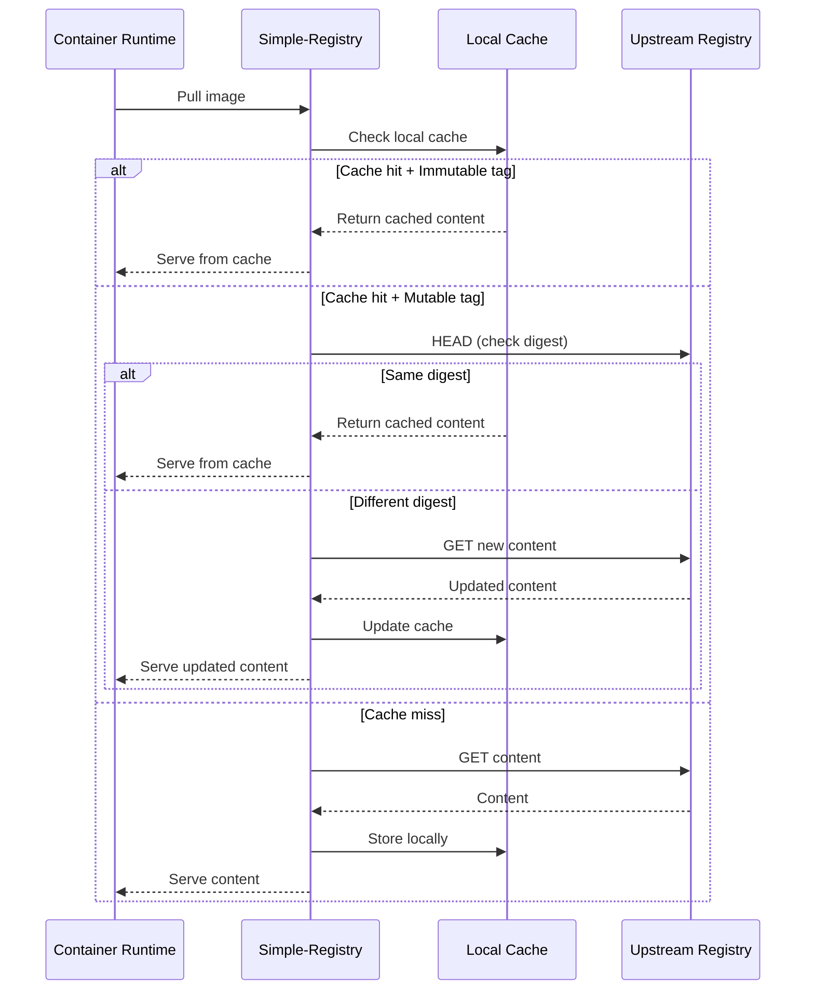
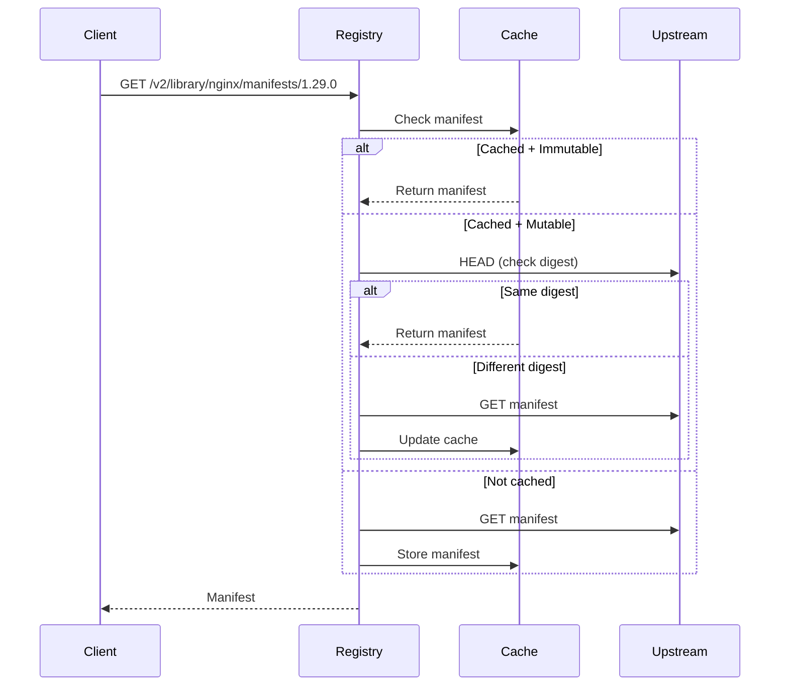
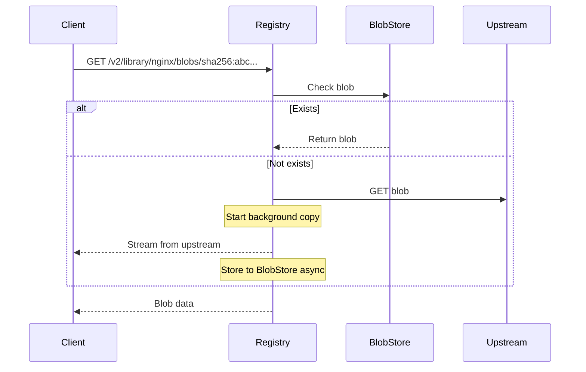
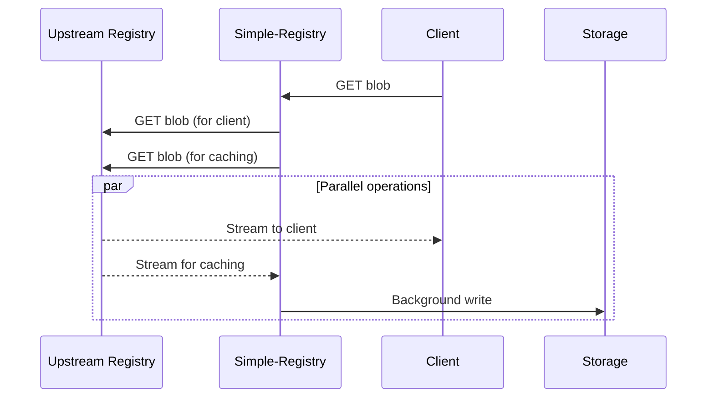

# Pull-Through Caching

Simple-Registry can act as a caching proxy for upstream container registries, reducing bandwidth, improving performance, and protecting against rate limits.

## How It Works



---

## Cache Behavior

### Cache Miss

When content isn't cached:

1. Registry checks first upstream
2. If unavailable, tries next upstream (fallback)
3. For manifests: fetches, stores, then returns
4. For blobs: streams to client while caching in background
5. Subsequent requests serve from cache

### Cache Hit

When content is cached:

**Immutable tags** (e.g., `nginx:1.29.0`):
- Served directly from cache
- No upstream check
- Maximum performance

**Mutable tags** (e.g., `nginx:latest`):
- Registry checks upstream for updates
- If same digest, serves from cache
- If different, refreshes cache

---

## Configuration

### Basic Setup

```toml
[[repository."library".upstream]]
url = "https://registry-1.docker.io"
username = "dockerhub-user"
password = "dockerhub-token"
```

### Multiple Upstreams (Fallback)

```toml
[[repository."library".upstream]]
url = "https://registry-1.docker.io"
username = "user"
password = "pass"

[[repository."library".upstream]]
url = "https://mirror.example.com"
# Fallback if primary is unavailable
```

### Immutable Tag Optimization

```toml
[repository."library"]
immutable_tags = true
immutable_tags_exclusions = ["^latest$", "^nightly.*$"]

[[repository."library".upstream]]
url = "https://registry-1.docker.io"
```

---

## Request Flow

### Manifest Request



### Blob Request



---

## Streaming Architecture

For blob cache misses, Simple-Registry streams data to the client while caching in the background:



This approach:
- Minimizes client latency (immediate streaming)
- Caches content asynchronously
- Handles large blobs efficiently

---

## Rate Limit Protection

### Problem

Upstream registries impose rate limits:
- Docker Hub: 100 pulls/6 hours (anonymous)
- Docker Hub: 200 pulls/6 hours (authenticated)
- Other registries vary

### Solution

Pull-through cache reduces upstream requests:

1. **First pull**: Fetches from upstream (counts against limit)
2. **Subsequent pulls**: Served from cache (no limit impact)
3. **Immutable tags**: Never re-check upstream
4. **Mutable tags**: Only lightweight HEAD requests

### Optimization Tips

1. Use authenticated upstream access (higher limits)
2. Enable immutable tags for versioned content
3. Pre-warm cache for frequently used images

---

## Authentication Methods

### Anonymous

```toml
[[repository."public".upstream]]
url = "https://public.registry.io"
```

### Basic Auth

```toml
[[repository."private".upstream]]
url = "https://private.registry.io"
username = "user"
password = "pass"
```

### mTLS

```toml
[[repository."secure".upstream]]
url = "https://secure.registry.io"
client_certificate = "/certs/client.crt"
client_private_key = "/certs/client.key"
server_ca_bundle = "/certs/ca.crt"
```

---

## Write Behavior

When pull-through cache is enabled:
- **Push operations are disabled**
- Clients receive `401 Unauthorized`
- The namespace is read-only

This prevents confusion between cached and local content.

---

## Multi-Registry Setup

Mirror multiple registries:

```toml
# Docker Hub official images
[repository."library"]
immutable_tags = true
immutable_tags_exclusions = ["^latest$"]

[[repository."library".upstream]]
url = "https://registry-1.docker.io"
username = "dockerhub-user"
password = "dockerhub-token"

# GitHub Container Registry
[repository."ghcr.io"]
immutable_tags = true

[[repository."ghcr.io".upstream]]
url = "https://ghcr.io"

# Quay.io
[repository."quay.io"]
immutable_tags = true

[[repository."quay.io".upstream]]
url = "https://quay.io"

# Private registry
[repository."internal"]

[[repository."internal".upstream]]
url = "https://registry.internal.example.com"
client_certificate = "/certs/client.crt"
client_private_key = "/certs/client.key"
```

---

## Token Caching

Upstream authentication tokens are cached:

```toml
[cache.redis]
url = "redis://redis:6379"
key_prefix = "token-cache"
```

Without Redis, tokens are cached in-memory per-instance.

---

## Performance Tuning

### Concurrency

```toml
[global]
max_concurrent_cache_jobs = 8  # Parallel upstream fetches
```

### Timeouts

```toml
[[repository."library".upstream]]
url = "https://registry-1.docker.io"
max_redirect = 5  # Follow up to 5 redirects
```

---

## Troubleshooting

### Slow First Pull

- Check upstream connectivity
- Verify credentials are valid
- Consider pre-warming cache

### Content Not Updating

- Check if tag is marked immutable
- Verify upstream connectivity
- Check exclusion patterns

### Rate Limit Errors

- Add authentication
- Enable immutable tags
- Add fallback upstreams
