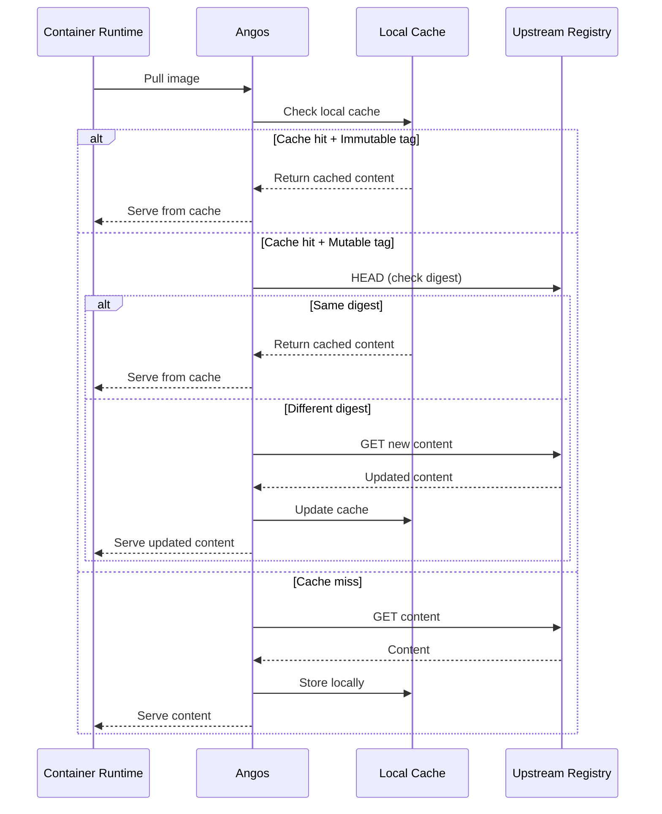
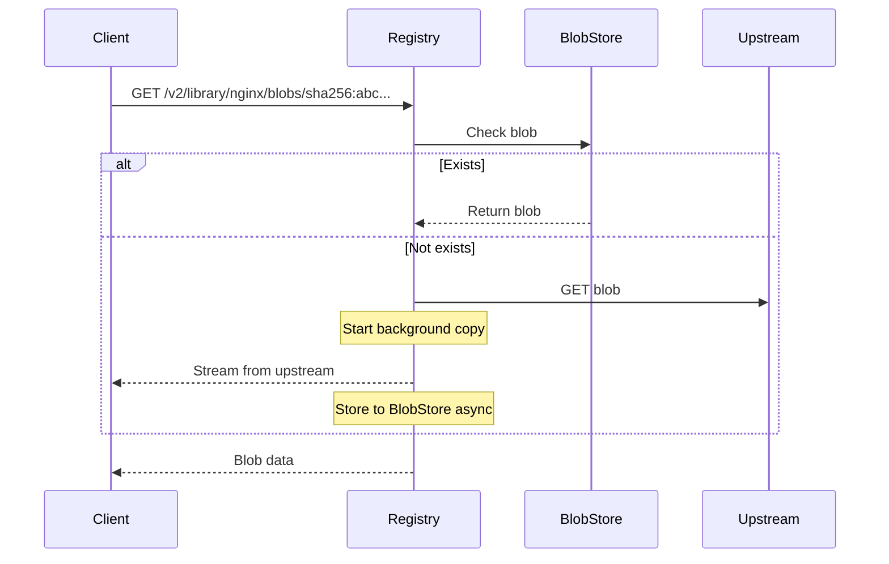
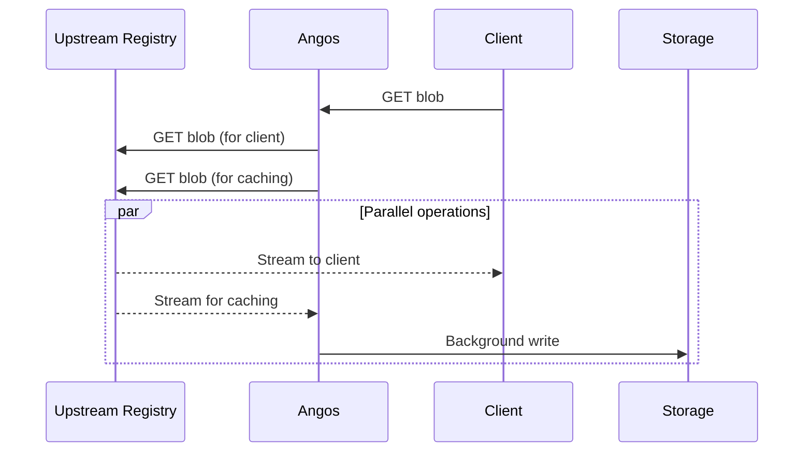

# Pull-Through Caching

Angos can act as a caching proxy for upstream container registries, reducing bandwidth, improving performance, and protecting against rate limits.

## How It Works


```mermaid
sequenceDiagram
    participant Client as Container Runtime
    participant Registry as Angos
    participant Cache as Local Cache
    participant Upstream as Upstream Registry

    Client->>Registry: Pull image

    Registry->>Cache: Check local cache

    alt Cache hit + Immutable tag
        Cache-->>Registry: Return cached content
        Registry-->>Client: Serve from cache
    else Cache hit + Mutable tag
        Registry->>Upstream: HEAD (check digest)
        alt Same digest
            Cache-->>Registry: Return cached content
            Registry-->>Client: Serve from cache
        else Different digest
            Registry->>Upstream: GET new content
            Upstream-->>Registry: Updated content
            Registry->>Cache: Update cache
            Registry-->>Client: Serve updated content
        end
    else Cache miss
        Registry->>Upstream: GET content
        Upstream-->>Registry: Content
        Registry->>Cache: Store locally
        Registry-->>Client: Serve content
    end
```

---

## Cache Behavior

### Cache Miss

When content isn't cached:

1. Registry checks first upstream
2. If unavailable, tries next upstream (fallback)
3. For manifests: fetches, stores, then returns
4. For blobs: streams to client while caching in background
5. Subsequent requests serve from cache

### Cache Hit

When content is cached:

**Immutable tags** (e.g., `nginx:1.29.0`):
- Served directly from cache
- No upstream check
- Maximum performance

**Mutable tags** (e.g., `nginx:latest`):
- Registry checks upstream for updates
- If same digest, serves from cache
- If different, refreshes cache

---

## Configuration

### Basic Setup

```toml
[[repository."library".upstream]]
url = "https://registry-1.docker.io"
username = "dockerhub-user"
password = "dockerhub-token"
```

### Multiple Upstreams (Fallback)

```toml
[[repository."library".upstream]]
url = "https://registry-1.docker.io"
username = "user"
password = "pass"

[[repository."library".upstream]]
url = "https://mirror.example.com"
# Fallback if primary is unavailable
```

### Immutable Tag Optimization

```toml
[repository."library"]
immutable_tags = true
immutable_tags_exclusions = ["^latest$", "^nightly.*$"]

[[repository."library".upstream]]
url = "https://registry-1.docker.io"
```

---

## Request Flow

### Blob Request


```mermaid
sequenceDiagram
    participant Client
    participant Registry
    participant BlobStore
    participant Upstream

    Client->>Registry: GET /v2/library/nginx/blobs/sha256:abc...

    Registry->>BlobStore: Check blob
    alt Exists
        BlobStore-->>Registry: Return blob
    else Not exists
        Registry->>Upstream: GET blob
        Note over Registry: Start background copy
        Registry-->>Client: Stream from upstream
        Note over Registry: Store to BlobStore async
    end

    Registry-->>Client: Blob data
```

> **Note:** On a blob cache miss, Angos fetches the blob twice from the upstream registry: once to stream directly to the client, and once to store in the cache.
> This doubles upstream bandwidth usage for uncached blobs.
> For rate-limited upstreams (e.g., Docker Hub), consider pre-warming your cache during off-peak hours.

---

## Streaming Architecture

For blob cache misses, Angos streams data to the client while caching in the background:


```mermaid
sequenceDiagram
    participant Upstream as Upstream Registry
    participant Registry as Angos
    participant Client
    participant Storage

    Client->>Registry: GET blob
    Registry->>Upstream: GET blob (for client)
    Registry->>Upstream: GET blob (for caching)

    par Parallel operations
        Upstream-->>Client: Stream to client
        Upstream-->>Registry: Stream for caching
        Registry->>Storage: Background write
    end
```

This approach:
- Minimizes client latency (immediate streaming)
- Caches content asynchronously
- Handles large blobs efficiently

---

## Rate Limit Protection

### Problem

Upstream registries impose rate limits. Docker Hub limits pulls per account or IP over a time window, with higher limits for authenticated and paid accounts; see [Docker Hub usage limits](https://docs.docker.com/docker-hub/usage/) for current figures. Other registries vary.

### Solution

Pull-through cache reduces upstream requests:

1. **First pull**: Fetches from upstream (counts against limit)
2. **Subsequent pulls**: Served from cache (no limit impact)
3. **Immutable tags**: Never re-check upstream
4. **Mutable tags**: Only lightweight HEAD requests

### Optimization Tips

1. Use authenticated upstream access (higher limits)
2. Enable immutable tags for versioned content
3. Pre-warm cache for frequently used images

---

## Authentication Methods

### Anonymous

```toml
[[repository."public".upstream]]
url = "https://public.registry.io"
```

### Basic Auth

```toml
[[repository."private".upstream]]
url = "https://private.registry.io"
username = "user"
password = "pass"
```

### mTLS

```toml
[[repository."secure".upstream]]
url = "https://secure.registry.io"
client_certificate = "/certs/client.crt"
client_private_key = "/certs/client.key"
server_ca_bundle = "/certs/ca.crt"
```

---

## Write Behavior

When pull-through cache is enabled:
- **Push operations are disabled**
- Clients receive `401 Unauthorized`
- The namespace is read-only

This prevents confusion between cached and local content.

---

## Multi-Registry Setup

Mirror multiple registries:

```toml
# Docker Hub official images
[repository."library"]
immutable_tags = true
immutable_tags_exclusions = ["^latest$"]

[[repository."library".upstream]]
url = "https://registry-1.docker.io"
username = "dockerhub-user"
password = "dockerhub-token"

# GitHub Container Registry
[repository."ghcr.io"]
immutable_tags = true

[[repository."ghcr.io".upstream]]
url = "https://ghcr.io"

# Quay.io
[repository."quay.io"]
immutable_tags = true

[[repository."quay.io".upstream]]
url = "https://quay.io"

# Private registry
[repository."internal"]

[[repository."internal".upstream]]
url = "https://registry.internal.example.com"
client_certificate = "/certs/client.crt"
client_private_key = "/certs/client.key"
```

---

## Upstream Selection and the `ns` Parameter

Which upstream serves a request is decided by configuration. The leading segments of a namespace name
the `[repository]` entry that owns it: `docker-hub/library/nginx` is served by
`[repository."docker-hub"]`, that entry's `upstream` list is what gets consulted, and the prefix is
stripped before the request is forwarded (`library/nginx` upstream). A namespace no entry matches has
no upstream and is served from local content alone.

A mirroring client such as containerd does not prefix its paths. It requests the upstream's own path
and names the registry it believes it is addressing in the `ns` query parameter, which the
distribution spec defines for exactly this in [Registry
Proxying](https://github.com/opencontainers/distribution-spec/blob/main/spec.md#registry-proxying):
optional on pull operations, naming the host component of the repository name the client used.
Declare that namespace on the repository mirroring it:

```toml
[repository."docker-hub"]
namespace = "docker.io"

[[repository."docker-hub".upstream]]
url = "https://registry-1.docker.io"
```

`GET /v2/library/nginx/manifests/latest?ns=docker.io` is then served from `docker-hub`, exactly as
`GET /v2/docker-hub/library/nginx/manifests/latest` is, and the response carries
`OCI-Namespace: docker.io`. Content cached either way lands under `docker-hub/library/nginx`, so the
two spellings share one cache, and an access policy sees that namespace whichever the client used.

The parameter scopes pulls, which is what the spec defines it for: a manifest or blob `GET`/`HEAD`, a
tag listing, a referrers listing. A write naming it is left addressing the namespace it spelled out,
so `ns` cannot put client-pushed content into a mirror's cache.

The parameter selects among configured repositories and nothing else. An `ns` no repository declares
as its `namespace` is ignored: the request is served as it arrived and no `OCI-Namespace` is echoed. The spec permits
that ("a registry MAY choose to ignore the `ns` query parameter") and pairs the header with use, so
its absence is what tells the client the namespace it named had no effect. A client cannot make Angos fetch from a
registry the configuration does not already name, and each upstream's content stays under its own
prefix rather than colliding with another's.

Two repositories declaring the same `namespace` is refused at startup: the parameter must resolve to one.

---

## Token Caching

Upstream authentication tokens are cached:

```toml
[cache.redis]
url = "redis://redis:6379"
key_prefix = "token-cache"
```

Without Redis, tokens are cached in-memory per-instance.

---

## Performance Tuning

### Concurrency

```toml
[global]
max_concurrent_cache_jobs = 8  # Parallel upstream fetches
```

For multi-replica deployments, see [Enable Durable Cache Jobs](../how-to/durable-cache-jobs.md)
to route cache-fill work through a shared queue drained by `angos worker`.

### Timeouts

```toml
[[repository."library".upstream]]
url = "https://registry-1.docker.io"
connect_timeout_secs = 30  # TCP + TLS handshake (default: 30)
read_timeout_secs = 300    # Inactivity between reads (default: 300)
```

`read_timeout_secs` bounds the stall between two reads, not the whole transfer: a slow but progressing blob download is never cut off by a total deadline.

### Redirects

`max_redirect` (default 5) caps how many upstream redirects a request follows:

```toml
[[repository."library".upstream]]
url = "https://registry-1.docker.io"
max_redirect = 5
```

---

## Troubleshooting

### Slow First Pull

- Check upstream connectivity
- Verify credentials are valid
- Consider pre-warming cache

### Content Not Updating

- Check if tag is marked immutable
- Verify upstream connectivity
- Check exclusion patterns

### Rate Limit Errors

- Add authentication
- Enable immutable tags
- Add fallback upstreams
