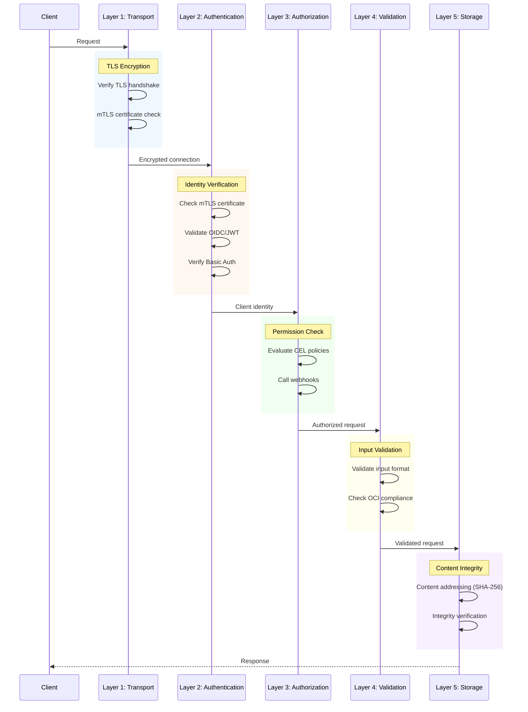
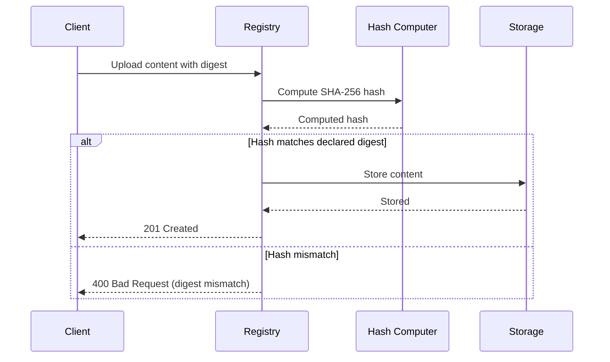

# Security Model

Angos implements defense-in-depth security with multiple layers of protection.

## Security Layers



---

## Trust Boundaries

### External Boundary

Between clients and registry:
- TLS encryption (required for production)
- Authentication credentials
- Rate limiting via concurrency control

### Internal Boundary

Between registry and storage:
- Separate credentials for S3
- Redis authentication for locks/cache
- Network isolation recommended

### Upstream Boundary

Between registry and upstream registries:
- Credential management
- Certificate validation
- Content verification

---

## Fail-Closed Design

Angos defaults to deny:

| Scenario | Behavior |
|----------|----------|
| No policies defined | Access denied |
| Webhook timeout | Access denied |
| Webhook error | Access denied |
| Invalid mTLS certificate | TLS handshake fails |
| Invalid OIDC token | Rejected immediately |
| Invalid Basic Auth password | Anonymous identity |
| CEL evaluation error | Rule skipped, evaluation continues |

### Policy Defaults

```toml
# Recommended: explicit allow
[global.access_policy]
default_allow = false
rules = ["identity.username != null"]
```

Without any policies, all access is denied.

---

## No Unsafe Code

```rust
#![forbid(unsafe_code)]
```

The entire codebase forbids unsafe Rust, eliminating memory safety vulnerabilities:
- No buffer overflows
- No use-after-free
- No null pointer dereferences
- No data races

---

## Cryptographic Security

### Password Storage

Argon2id with strong parameters:
- Memory-hard (resists GPU attacks)
- Time-cost balanced for security/performance
- Salt per-password

```bash
./angos argon
# Generates: $argon2id$v=19$m=19456,t=2,p=1$...
```

### JWT Validation

OIDC tokens are fully verified:
- Signature against provider's JWKS
- Algorithm allowlist (RS256, RS384, RS512, ES256, ES384)
- Issuer claim must match
- Audience claim checked if configured
- Expiration enforced
- Clock skew tolerance configurable

### TLS Configuration

Server TLS with modern defaults:
- TLS 1.2+ only
- Strong cipher suites
- Certificate chain validation

---

## Input Validation

### OCI Compliance

All inputs validated against OCI specification:
- Digest format validation
- Reference format validation
- Media type validation
- Manifest structure validation

### Request Validation

- Path traversal prevention
- Size limits on uploads
- Timeout enforcement
- Content-type validation

---

## Content Integrity

### Content Addressing

All content addressed by cryptographic hash:
- SHA-256 (default)
- SHA-512 (supported)
- No mutable references to content

### Verification Flow



### Immutable Content

Once stored, blobs are immutable:
- Same digest = same content
- Prevents tampering
- Enables caching

---

## Authorization Security

### CEL Sandboxing

CEL expressions run in a sandboxed environment:
- No file system access
- No network access
- No code execution
- Deterministic evaluation

### Webhook Security

Webhook calls are secured:
- HTTPS recommended
- Authentication (Bearer, Basic, mTLS)
- Timeout enforcement
- Certificate validation

---

## Secrets Management

### Configuration

Sensitive values in configuration:
- Stored on disk (protect with file permissions)
- Not logged
- Automatically cleared from memory when dropped (zeroize)

### Recommendations

1. Use environment variables for secrets in containers
2. Use Kubernetes Secrets or similar
3. Restrict file permissions on config
4. Rotate credentials regularly

---

## Audit Trail

### Logging

Security-relevant events are logged:
- Authentication attempts (success/failure)
- Authorization decisions
- Configuration changes

### Metrics

Security metrics exposed:
- `auth_attempts_total{method, result}`
- `webhook_authorization_requests_total{webhook, result}`

---

## Network Security

### Recommendations

1. **TLS everywhere**: Always enable TLS in production
2. **Network isolation**: Separate registry network from public
3. **Firewall rules**: Restrict access to necessary ports
4. **Private endpoints**: Use VPC endpoints for S3

### Internal Services

Redis and S3 should be:
- On private network
- Authenticated
- Encrypted in transit

---

## Operational Security

### Configuration Reloading

- Configuration changes logged
- Invalid configurations rejected
- Certificates reload without restart

### Storage Maintenance

- Run scrub with least privilege
- Audit what's deleted
- Use dry-run first

### Monitoring

Detect anomalies:
- Unusual authentication failures
- Unexpected webhook denials
- High error rates

---

## Security Checklist

### Deployment

- [ ] TLS enabled with valid certificates
- [ ] Strong passwords for basic auth (use argon)
- [ ] Access policies configured
- [ ] Webhook authentication configured
- [ ] Redis authentication enabled (if used)
- [ ] S3 credentials properly secured

### Operations

- [ ] Logs monitored for security events
- [ ] Metrics alerting configured
- [ ] Certificate rotation automated
- [ ] Regular security updates applied
- [ ] Backup and recovery tested

### Policies

- [ ] default_allow = false
- [ ] Minimum necessary access granted
- [ ] Production/development separated
- [ ] Delete operations restricted

---

## Vulnerability Reporting

Report security issues to:
https://github.com/project-angos/angos/security

Do not open public issues for security vulnerabilities.
