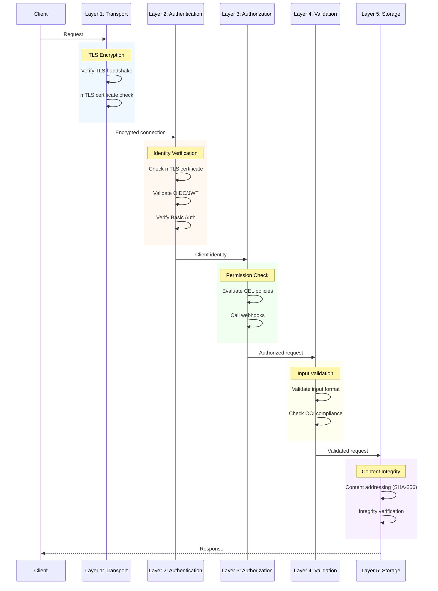
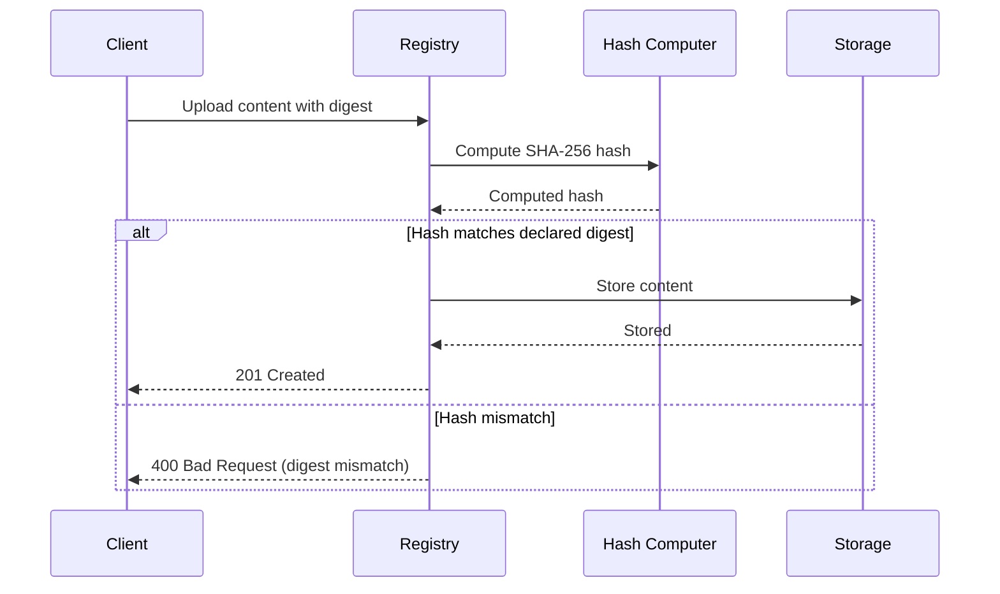

# Security Model

Angos implements defense-in-depth security with multiple layers of protection.

## Security Layers


```mermaid
sequenceDiagram
    participant Client
    participant TLS as Layer 1: Transport
    participant Auth as Layer 2: Authentication
    participant Authz as Layer 3: Authorization
    participant Valid as Layer 4: Validation
    participant Store as Layer 5: Storage

    Client->>TLS: Request

    rect rgb(240, 248, 255)
        Note over TLS: TLS Encryption
        TLS->>TLS: Verify TLS handshake
        TLS->>TLS: mTLS certificate check
    end

    TLS->>Auth: Encrypted connection

    rect rgb(255, 248, 240)
        Note over Auth: Identity Verification
        Auth->>Auth: Check mTLS certificate
        Auth->>Auth: Validate OIDC/JWT
        Auth->>Auth: Verify Basic Auth
    end

    Auth->>Authz: Client identity

    rect rgb(240, 255, 240)
        Note over Authz: Permission Check
        Authz->>Authz: Evaluate CEL policies
        Authz->>Authz: Call webhooks
    end

    Authz->>Valid: Authorized request

    rect rgb(255, 255, 240)
        Note over Valid: Input Validation
        Valid->>Valid: Validate input format
        Valid->>Valid: Check OCI compliance
    end

    Valid->>Store: Validated request

    rect rgb(248, 240, 255)
        Note over Store: Content Integrity
        Store->>Store: Content addressing (SHA-256)
        Store->>Store: Integrity verification
    end

    Store-->>Client: Response
```

---

## Trust Boundaries

### External Boundary

Between clients and registry:
- TLS encryption (required for production)
- Authentication credentials
- Rate limiting via concurrency control

### Internal Boundary

Between registry and storage:
- Separate credentials for S3
- Redis authentication for locks/cache
- Network isolation recommended

### Upstream Boundary

Between registry and upstream registries:
- Credential management
- Certificate validation
- Content verification

---

## Fail-Closed Design

Angos implements fail-closed authorization for critical security decisions:

| Scenario                                   | Behavior                                |
|--------------------------------------------|-----------------------------------------|
| No policies defined                        | Access denied (fail-closed)             |
| No authentication provided                 | Proceeds as anonymous identity          |
| Webhook timeout or unreachable             | Access denied (fail-closed), not cached |
| Webhook 429 / 5xx                          | Access denied (fail-closed), not cached |
| Webhook not configured                     | Not evaluated, access continues         |
| Invalid mTLS certificate                   | TLS handshake fails                     |
| No client cert, `client_auth = "required"` | TLS handshake fails                     |
| Invalid OIDC token                         | 401 Unauthorized (fail-closed)          |
| Invalid Basic Auth password                | 401 Unauthorized (fail-closed)          |
| CEL evaluation error                       | Access denied (fail-closed)             |
| CEL non-boolean result (any mode)          | Access denied (fail-closed)             |

**Important:** Without authentication, requests proceed with an anonymous identity. Without access policies, the default behavior is to deny access (`default = "deny"`). To allow anonymous reads, you must explicitly configure access policies with appropriate rules.

### Policy Defaults

```toml
# Recommended: explicit allow
[global.access_policy]
default = "deny"
rules = ["identity.username != null"]
```

Without any policies, all access is denied.

---

## No Unsafe Code

```rust
#![forbid(unsafe_code)]
```

The entire codebase forbids unsafe Rust, eliminating memory safety vulnerabilities:
- No buffer overflows
- No use-after-free
- No null pointer dereferences
- No data races

---

## Cryptographic Security

### Password Storage

Argon2id with strong parameters:
- Memory-hard (resists GPU attacks)
- Time-cost balanced for security/performance
- Salt per-password

```bash
./angos argon
# Generates: $argon2id$v=19$m=19456,t=2,p=1$...
```

### JWT Validation

OIDC tokens are fully verified:
- Signature against provider's JWKS
- Per-provider algorithm allowlist before signature verification, defaulting to RS256
- One cache-bypassing JWKS refresh when a cached key set misses a token `kid`
- Issuer claim must match
- Audience claim checked if configured
- Expiration enforced
- Clock skew tolerance configurable

### Registry Tokens

Tokens the token service issues are HMAC-signed with a key of at least 32 bytes and their algorithm is pinned, so a token claiming another algorithm is never verified with the signing key. They carry the identity but never the client certificate or IP, which keeps a certificate-bound identity from becoming a replayable bearer credential.

A token cannot be revoked before it expires: `ttl_secs`, capped at a day, is the window a stolen one stays usable. Nor can it be exchanged for a fresh one at `/token`, so that window never extends itself past the credential the token was minted from. Rotating `secret_key` or removing the OIDC provider a token names invalidates outstanding tokens. Authorization is unaffected, since policies are evaluated per request against live configuration rather than frozen into the token.

The token is not scope-bound either. Where the registry v2 model narrows a token to one repository and a set of actions through an `access` claim, angos puts the identity in the token, so a stolen one reaches everything that identity reaches. What bounds it is the per-request policy evaluation above: the token grants no more than the credential it replaced, just over a wider surface than a scoped token would.

That spec's claim set (`iss`, `sub`, `aud`, `nbf`, `jti`, `access`) and its `kid` header exist so a registry can verify tokens minted by a separate authorization server. Angos is both issuer and verifier, so its token is opaque to clients and carries only the identity it restores.

### TLS Configuration

Server TLS with modern defaults:
- TLS 1.2+ only
- Strong cipher suites
- Certificate chain validation

---

## Input Validation

### OCI Compliance

All inputs validated against OCI specification:
- Digest format validation
- Reference format validation
- Media type validation
- Manifest structure validation

### Request Validation

- Path traversal prevention
- Size limits on uploads
- Timeout enforcement
- Content-type validation

---

## Content Integrity

### Content Addressing

All content addressed by cryptographic hash:
- SHA-256 (default)
- SHA-512 (supported)
- No mutable references to content

### Verification Flow


```mermaid
sequenceDiagram
    participant Client
    participant Registry
    participant Hasher as Hash Computer
    participant Storage

    Client->>Registry: Upload content with digest
    Registry->>Hasher: Compute SHA-256 hash
    Hasher-->>Registry: Computed hash

    alt Hash matches declared digest
        Registry->>Storage: Store content
        Storage-->>Registry: Stored
        Registry-->>Client: 201 Created
    else Hash mismatch
        Registry-->>Client: 400 Bad Request (digest mismatch)
    end
```

### Immutable Content

Once stored, blobs are immutable:
- Same digest = same content
- Prevents tampering
- Enables caching

---

## Authorization Security

### CEL Sandboxing

CEL expressions run in a sandboxed environment:
- No file system access
- No network access
- No code execution
- Deterministic evaluation

### Webhook Security

Webhook calls are secured:
- HTTPS recommended
- Authentication (Bearer, Basic, mTLS)
- Timeout enforcement
- Certificate validation

---

## Secrets Management

### Configuration

Sensitive values in configuration:
- Stored on disk (protect with file permissions)
- Not logged
- Automatically cleared from memory when dropped (zeroize)

### Recommendations

1. Keep credentials in a separate configuration file and pass both with `-c`, so the file your deployment tooling renders holds no secrets
2. Use Kubernetes Secrets or similar for that file
3. Restrict file permissions on config
4. Rotate credentials regularly

Angos reads no credentials from environment variables. An environment is fixed
when the process starts, so a rotated secret would need a restart, and it is
readable through `/proc/<pid>/environ` and core dumps. A credentials file is
watched like any other configuration file, so rotating it applies without a
restart.

---

## Audit Trail

### Logging

Security-relevant events are logged:
- Authentication attempts (success/failure)
- Authorization decisions
- Configuration changes

### Metrics

Security metrics exposed:
- `auth_attempts_total{method, result}`
- `webhook_authorization_requests_total{webhook, result}`

---

## Network Security

### Recommendations

1. **TLS everywhere**: Always enable TLS in production
2. **Network isolation**: Separate registry network from public
3. **Firewall rules**: Restrict access to necessary ports
4. **Private endpoints**: Use VPC endpoints for S3

### Internal Services

Redis and S3 should be:
- On private network
- Authenticated
- Encrypted in transit

---

## Operational Security

### Configuration Reloading

- Configuration changes logged
- Invalid configurations rejected
- Certificates reload without restart

### Storage Maintenance

- Run scrub with least privilege
- Audit what's deleted
- Use dry-run first

### Monitoring

Detect anomalies:
- Unusual authentication failures
- Unexpected webhook denials
- High error rates

---

## Security Checklist

### Deployment

- [ ] TLS enabled with valid certificates
- [ ] Strong passwords for basic auth (use argon)
- [ ] Access policies configured
- [ ] Webhook authentication configured
- [ ] Redis authentication enabled (if used)
- [ ] S3 credentials properly secured

### Operations

- [ ] Logs monitored for security events
- [ ] Metrics alerting configured
- [ ] Certificate rotation automated
- [ ] Regular security updates applied
- [ ] Backup and recovery tested

### Policies

- [ ] default = "deny"
- [ ] Minimum necessary access granted
- [ ] Production/development separated
- [ ] Delete operations restricted

---

## Vulnerability Reporting

Report security issues to:
https://github.com/project-angos/angos/security

Do not open public issues for security vulnerabilities.
