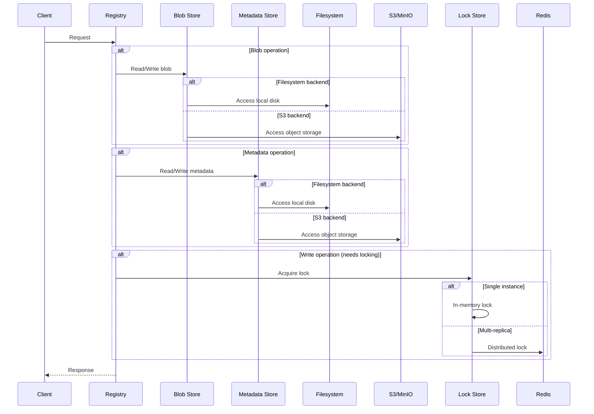
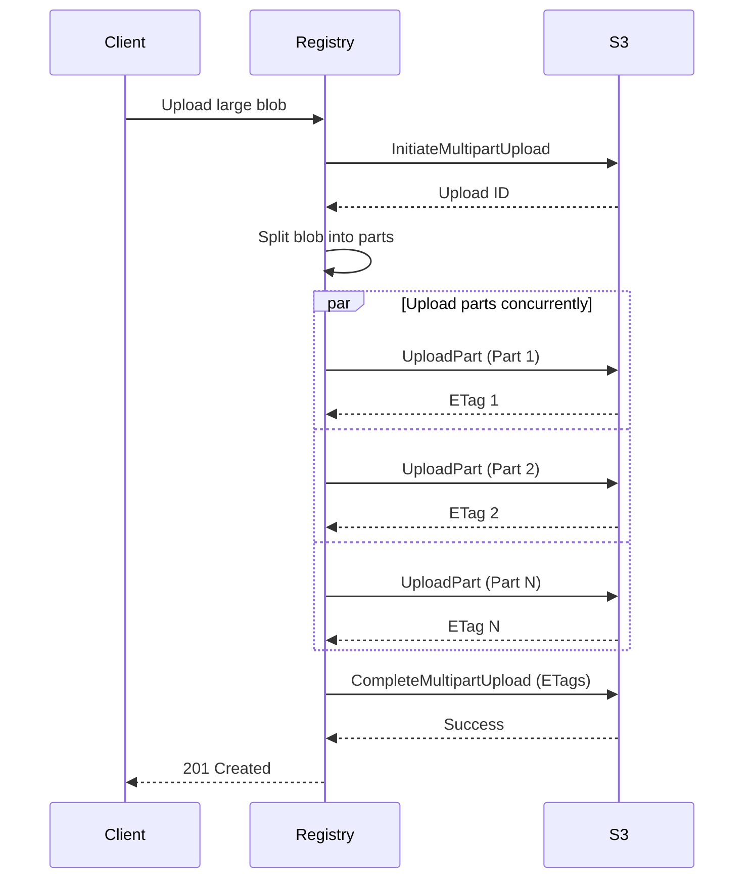

# Storage Backends

Simple-Registry supports two storage backends: filesystem and S3-compatible object storage.
This document explains when to use each and their trade-offs.

## Overview



---

## Blob Store vs Metadata Store

Simple-Registry separates storage into two logical stores:

| Store              | Contents               | Size       | Access Pattern          |
|--------------------|------------------------|------------|-------------------------|
| **Blob Store**     | Layer data, configs    | Large (GB) | Sequential read/write   |
| **Metadata Store** | Manifests, tags, links | Small (KB) | Random access, frequent |

By default, both use the same backend. You can configure them independently:

```toml
# Both filesystem
[blob_store.fs]
root_dir = "/data/blobs"

[metadata_store.fs]
root_dir = "/data/metadata"
```

```toml
# Or split: blobs on S3, metadata on filesystem
[blob_store.s3]
bucket = "registry-blobs"
# ...

[metadata_store.fs]
root_dir = "/data/metadata"
```

---

## Filesystem Backend

### When to Use

- Single-instance deployments
- Development and testing
- When S3 is not available
- Low-latency requirements

### Configuration

```toml
[blob_store.fs]
root_dir = "/var/registry/data"
sync_to_disk = false  # Set true for durability

[metadata_store.fs]
root_dir = "/var/registry/data"  # Can be same as blob store
```

### Trade-offs

**Advantages:**
- Simple setup
- Low latency
- No external dependencies
- Cost-effective for small deployments

**Disadvantages:**
- Limited to single node (without shared filesystem)
- Scaling requires shared storage (NFS, EFS)
- No built-in redundancy

### Durability Options

```toml
[blob_store.fs]
root_dir = "/data"
sync_to_disk = true  # fsync after writes
```

- `sync_to_disk = false`: Faster, relies on OS buffering
- `sync_to_disk = true`: Slower, guaranteed durability

---

## S3 Backend

### When to Use

- Multi-replica deployments
- High availability requirements
- Large storage needs
- Cloud-native infrastructure

### Configuration

```toml
[blob_store.s3]
access_key_id = "AKIA..."
secret_key = "..."
endpoint = "https://s3.amazonaws.com"
bucket = "my-registry"
region = "us-east-1"
key_prefix = "blobs/"  # Optional

# Multipart settings
multipart_part_size = "50MiB"
multipart_copy_threshold = "5GB"
multipart_copy_chunk_size = "100MB"
multipart_copy_jobs = 4

# Reliability settings
max_attempts = 3
operation_timeout_secs = 900
operation_attempt_timeout_secs = 300
```

### Trade-offs

**Advantages:**
- Unlimited scalability
- Built-in redundancy
- Multi-replica support
- Pay-per-use pricing

**Disadvantages:**
- Higher latency than local disk
- Network dependency
- Potential egress costs
- Requires Redis for locking

### Compatible Services

- AWS S3
- MinIO
- Exoscale SOS
- DigitalOcean Spaces
- Backblaze B2
- Cloudflare R2
- Any S3-compatible storage

---

## Multi-Replica Deployments

For multiple registry instances, you need:
1. **Shared storage**: S3 or shared filesystem
2. **Distributed locking**: Redis

### With S3 + Redis

```toml
[blob_store.s3]
bucket = "registry-data"
# ... S3 config

[metadata_store.s3]
bucket = "registry-data"
# ... S3 config

[metadata_store.s3.redis]
url = "redis://redis:6379"
ttl = 10
key_prefix = "registry-locks"

[cache.redis]
url = "redis://redis:6379"
```

### With Shared Filesystem + Redis

```toml
[blob_store.fs]
root_dir = "/mnt/nfs/registry"

[metadata_store.fs]
root_dir = "/mnt/nfs/registry"

[metadata_store.fs.redis]
url = "redis://redis:6379"
ttl = 10

[cache.redis]
url = "redis://redis:6379"
```

---

## Locking Behavior

### In-Memory Locking (Default)

- Used when Redis is not configured
- Only safe for single-instance deployments
- No coordination between replicas

### Redis Locking

Required for multi-replica:

```toml
[metadata_store.fs.redis]
url = "redis://redis:6379"
ttl = 10                    # Lock timeout in seconds
key_prefix = "locks"        # Optional prefix
max_retries = 100           # Retry attempts
retry_delay_ms = 10         # Delay between retries
```

Lock is held during:
- Manifest writes (tag updates)
- Blob link creation
- Upload completion

---

## Multipart Uploads (S3)

Large blobs use multipart uploads:



Configuration:

```toml
[blob_store.s3]
# Minimum part size (parts are at least this large)
multipart_part_size = "50MiB"

# Blobs larger than this use multipart copy
multipart_copy_threshold = "5GB"

# Size of each copy chunk
multipart_copy_chunk_size = "100MB"

# Concurrent copy operations
multipart_copy_jobs = 4
```

---

## Performance Considerations

### Filesystem

- **SSD vs HDD**: SSD recommended for metadata
- **RAID**: Consider RAID for redundancy
- **Filesystem**: ext4 or XFS recommended

### S3

- **Region**: Minimize latency with nearby region
- **VPC Endpoint**: Reduce costs and latency
- **Part Size**: Larger parts = fewer requests, more memory

### Caching

Token and key caching reduces external requests:

```toml
[cache.redis]
url = "redis://redis:6379"
key_prefix = "cache"
```

Without Redis, cache is in-memory per-instance.

---

## Migration

### Filesystem to S3

1. Stop the registry
2. Copy data to S3:
   ```bash
   aws s3 sync /data/registry s3://my-bucket/
   ```
3. Update configuration
4. Start the registry

### S3 to Filesystem

1. Stop the registry
2. Download data:
   ```bash
   aws s3 sync s3://my-bucket/ /data/registry/
   ```
3. Update configuration
4. Start the registry

---

## Decision Matrix

| Requirement        | Filesystem    | S3 |
|--------------------|---------------|----|
| Single instance    | ✅             | ✅ |
| Multiple instances | ❌ (needs NFS) | ✅ |
| High availability  | ❌             | ✅ |
| Low latency        | ✅             | ❌ |
| Simple setup       | ✅             | ❌ |
| Cost (small scale) | ✅             | ❌ |
| Cost (large scale) | ❌             | ✅ |
| Unlimited storage  | ❌             | ✅ |
