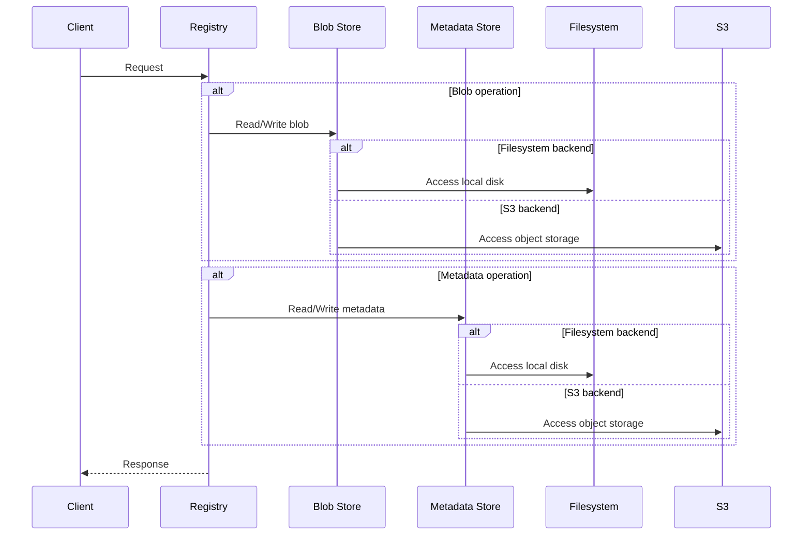
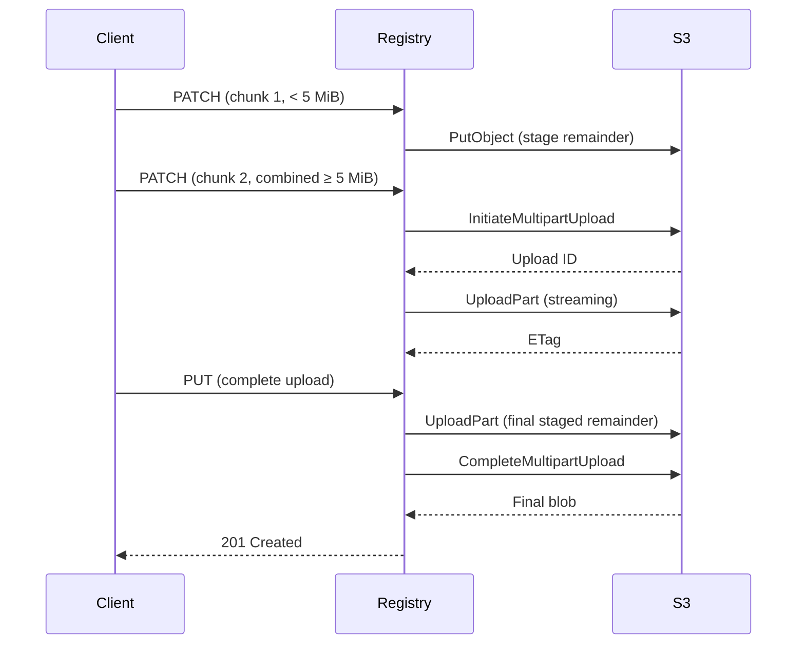
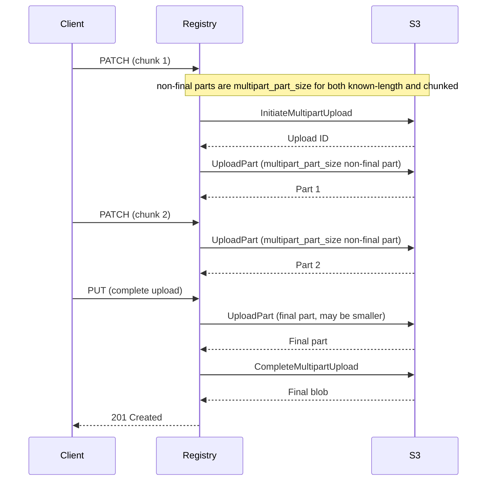

# Storage Backends

Angos supports two storage backends: filesystem and S3-compatible object storage.
This document explains when to use each and their trade-offs.

## Overview


```mermaid
sequenceDiagram
    participant Client
    participant Registry
    participant BlobStore as Blob Store
    participant MetaStore as Metadata Store
    participant FS as Filesystem
    participant S3 as S3

    Client->>Registry: Request

    alt Blob operation
        Registry->>BlobStore: Read/Write blob
        alt Filesystem backend
            BlobStore->>FS: Access local disk
        else S3 backend
            BlobStore->>S3: Access object storage
        end
    end

    alt Metadata operation
        Registry->>MetaStore: Read/Write metadata
        alt Filesystem backend
            MetaStore->>FS: Access local disk
        else S3 backend
            MetaStore->>S3: Access object storage
        end
    end

    Registry-->>Client: Response
```

---

## Blob Store vs Metadata Store

Angos separates storage into two logical stores:

| Store              | Contents                                | Size       | Access Pattern          |
|--------------------|-----------------------------------------|------------|-------------------------|
| **Blob Store**     | Layers, configs, manifest bodies        | Large (GB) | Sequential read/write   |
| **Metadata Store** | Manifest links, tags, blob-index reference keys | Small (KB) | Random access, frequent |

By default, both use the same backend. You can configure them independently:

```toml
# Both filesystem
[blob_store.fs]
root_dir = "/data/blobs"

[metadata_store.fs]
root_dir = "/data/metadata"
```

```toml
# Or split: blobs on S3, metadata on filesystem
[blob_store.s3]
bucket = "registry-blobs"
# ...

[metadata_store.fs]
root_dir = "/data/metadata"
```

---

## Filesystem Backend

### When to Use

- Single-instance deployments
- Development and testing
- When S3 is not available
- Low-latency requirements

### Configuration

```toml
[blob_store.fs]
root_dir = "/var/registry/data"
sync_to_disk = false  # Set true for durability

[metadata_store.fs]
root_dir = "/var/registry/data"  # Can be same as blob store
```

### Trade-offs

**Advantages:**
- Simple setup
- Low latency
- No external dependencies
- Cost-effective for small deployments

**Disadvantages:**
- Single-instance only: no multi-replica support without a shared storage
- No built-in redundancy or high availability
- Shared filesystem (NFS, EFS) not recommended for production (see below)

### Durability Options

```toml
[blob_store.fs]
root_dir = "/data"
sync_to_disk = true  # fsync after writes
```

- `sync_to_disk = true`: Every write is flushed to disk with `fsync()`, guaranteeing durability at the cost of higher write latency.
- `sync_to_disk = false` (default): Relies on OS page cache for better performance. Acceptable when the underlying storage already provides durability guarantees (e.g., battery-backed RAID, ZFS, cloud block storage with replication). Without such guarantees, data may be lost on crash or power failure.

---

## S3 Backend

### When to Use

- Multi-replica deployments
- High availability requirements
- Large storage needs
- Cloud-native infrastructure

### Configuration

```toml
[blob_store.s3]
access_key_id = "AKIA..."
secret_key = "..."
endpoint = "https://s3.amazonaws.com"
bucket = "my-registry"
region = "us-east-1"
key_prefix = "blobs/"  # Optional

# Multipart settings
multipart_part_size = "50MiB"
multipart_copy_threshold = "5GB"
multipart_copy_chunk_size = "100MB"
multipart_copy_jobs = 4

# Reliability settings
max_attempts = 3
operation_timeout_secs = 900
operation_attempt_timeout_secs = 300
```

### Trade-offs

**Advantages:**
- Unlimited scalability
- Built-in redundancy
- Multi-replica support
- Pay-per-use pricing

**Disadvantages:**
- Higher latency than local disk
- Network dependency
- Potential egress costs
- The job queue probes conditional writes (`If-None-Match: *`) at startup; a provider that does not enforce them degrades to advisory claims, where a claim race may run an idempotent job more than once

### Compatible Services

- AWS S3
- Exoscale SOS
- DigitalOcean Spaces
- Backblaze B2
- Cloudflare R2
- Any S3-compatible storage

---

## Multi-Replica Deployments

For multiple registry instances you need shared storage: S3, or a shared
filesystem (see the caveats below). No lock backend and no extra
infrastructure is required: reads and writes are lock-free everywhere.
Registry metadata is write-once and ordered (see Write Coordination below),
blob reclamation is fenced by the `v2/gc/` marker protocol, and the job
queue serialises workers with leased claim keys created atomically
(`create_if_absent`: `link(2)` on FS, `If-None-Match: *` on S3).

### Deprecated Lock Configuration

`lock_strategy` (including the `[metadata_store.*.lock_strategy.redis]` and
`[metadata_store.*.lock_strategy.s3]` sub-tables), a bare
`[metadata_store.*.redis]` table, and `conditional_operations` are accepted
and ignored. Remove them at your convenience.

### Shared Filesystem (Not Recommended)

Shared filesystems (NFS, EFS) defeat Angos's stateless design and are not recommended for production:

- **Atomicity**: the queue's claim keys rely on an honest atomic `link(2)`, which NFS implementations get wrong often enough that a startup probe verifies it
- **Performance tuning**: NFS requires careful tuning of cache coherency
- **Scaling issues**: metadata round-trips worsen as replicas increase

For multi-replica deployments, use S3 instead: conditional writes give the queue its atomic claim keys with no additional infrastructure.

---

## Blob Upload Modes (S3)

The registry supports two modes for uploading blobs to S3. By default, it uses the **non-uniform upload mode**, which is faster and works with most S3 providers. If your S3 provider requires uniform part sizes, switch to **uniform upload mode**.

### Non-Uniform Upload Mode (Default)

This is the recommended mode for most deployments. Each OCI `PATCH` request streams directly to S3:


```mermaid
sequenceDiagram
    participant Client
    participant Registry
    participant S3

    Client->>Registry: PATCH (chunk 1, < 5 MiB)
    Registry->>S3: PutObject (stage remainder)

    Client->>Registry: PATCH (chunk 2, combined ≥ 5 MiB)
    Registry->>S3: InitiateMultipartUpload
    S3-->>Registry: Upload ID
    Registry->>S3: UploadPart (streaming)
    S3-->>Registry: ETag

    Client->>Registry: PUT (complete upload)
    Registry->>S3: UploadPart (final staged remainder)
    Registry->>S3: CompleteMultipartUpload
    S3-->>Registry: Final blob
    Registry-->>Client: 201 Created
```

Configuration:

```toml
[blob_store.s3]
multipart_uniform_parts = false  # Default
```

A `PATCH` that carries a `Content-Length` header streams toward S3 with that known length, frame-by-frame without buffering the whole chunk. A chunked `PATCH` with no `Content-Length` (sent by `docker push`) is streamed to EOF. When `multipart_part_size` is above the 5 MiB floor, it is coalesced server-side into `part_size` parts via `UploadPartCopy`: each part is assembled in a scratch multipart of 5 MiB sub-parts, then grafted into the main upload. At most one 5 MiB sub-part is held in memory, and each byte is moved twice within S3. When `multipart_part_size` is exactly 5 MiB, the chunked `PATCH` streams plain 5 MiB parts directly with no coalescing. In all cases the multipart upload is opened **lazily**: bytes below the 5 MiB S3 minimum are parked at a per-session staging key and combined with the next `PATCH`, so a multipart session is created only once there are enough bytes to flush a part of at least 5 MiB. An upload whose total never reaches 5 MiB skips multipart entirely: `complete` promotes the staged object to the upload key with a single `CopyObject`.

**Memory usage:** on the known-length path bytes stream frame-by-frame, so memory is essentially constant regardless of blob size; a coalesced chunked `PATCH` (`multipart_part_size` above the 5 MiB floor) buffers at most one 5 MiB sub-part at a time while coalescing into `part_size` parts. The only other buffered data is the sub-part remainder (< 5 MiB), which is parked in S3 between `PATCH` calls and re-read when the next chunk arrives.

### Uniform Upload Mode

If your S3 provider strictly enforces uniform non-final part sizes and rejects uploads with variable part sizes, enable uniform mode:


```mermaid
sequenceDiagram
    participant Client
    participant Registry
    participant S3

    Client->>Registry: PATCH (chunk 1)
    Note over Registry,S3: non-final parts are multipart_part_size for both known-length and chunked
    Registry->>S3: InitiateMultipartUpload
    S3-->>Registry: Upload ID
    Registry->>S3: UploadPart (multipart_part_size non-final part)
    S3-->>Registry: Part 1

    Client->>Registry: PATCH (chunk 2)
    Registry->>S3: UploadPart (multipart_part_size non-final part)
    S3-->>Registry: Part 2

    Client->>Registry: PUT (complete upload)
    Registry->>S3: UploadPart (final part, may be smaller)
    S3-->>Registry: Final part
    Registry->>S3: CompleteMultipartUpload
    S3-->>Registry: Final blob
    Registry-->>Client: 201 Created
```

Configuration:

```toml
[blob_store.s3]
multipart_uniform_parts = true
multipart_part_size = "50MiB"
```

In this mode the multipart upload is opened on the first full part and maintained across the remaining `PATCH` requests. Both a known-length `PATCH` and a chunked `PATCH` (no `Content-Length`, as `docker push` sends) commit non-final parts of exactly `multipart_part_size` bytes; the final part may be smaller, which is what strict providers require.

**Memory usage:** full parts stream to S3 in small read frames; only the trailing sub-part remainder (smaller than `multipart_part_size`) is staged in S3 between calls. A chunked `PATCH` buffers up to one `multipart_part_size` part, the same as the known-length remainder.

### Related Configuration

```toml
[blob_store.s3]
# Part size (multipart assembly threshold)
multipart_part_size = "50MiB"

# Blobs larger than this use multipart copy
multipart_copy_threshold = "5GB"

# Size of each server-side copy part
multipart_copy_chunk_size = "100MB"

# Concurrent server-side copy operations
multipart_copy_jobs = 4
```

During S3 upload completion, Angos copies the assembled upload object into the
content-addressed blob path. Objects at or below `multipart_copy_threshold` use a
single S3 `CopyObject`; larger objects use S3 multipart copy with ranged
`UploadPartCopy` requests. This keeps large blob completion inside S3's supported
copy limits without proxying blob bytes through Angos.

---

## Performance Considerations

### Filesystem

- **SSD vs HDD**: SSD recommended for metadata
- **RAID**: Consider RAID for redundancy
- **Filesystem**: ext4 or XFS recommended

### S3

**Connectivity:**
- **Region**: Minimize latency with nearby region
- **VPC Endpoint**: Reduce costs and latency by avoiding internet gateway

**Multipart Upload:**
- **Part size** (`multipart_part_size`, default 50 MiB): Larger parts reduce S3 requests. Uniform mode streams full parts and only buffers the trailing staged chunk.
- **Uniform parts** (`multipart_uniform_parts`, default false): Set to `true` only if your S3 provider strictly requires uniform non-final part sizes.

**Timeout Configuration:**
- **`operation_timeout_secs`** (default 900s): Total time allowed for the entire operation (e.g., upload or copy)
- **`operation_attempt_timeout_secs`** (default 300s): Timeout per individual HTTP request attempt, and the inactivity timeout on a streaming download (a blob pull is bounded by how long the transfer stalls, not by how long it takes)
- Set `operation_attempt_timeout_secs` high enough to tolerate your worst-case S3 latency, but not so high that failed requests block indefinitely

**Retry Strategy:**
- **`max_attempts`** (default 3): Number of times to retry a failed request
- Retries wait an exponential, jittered backoff (50ms doubling to a 1s ceiling) so a throttled bucket is not hammered
- Increase for unreliable networks, decrease if timeouts are common

### S3 Metadata Optimizations

When using S3 for metadata, Angos includes several optimizations to reduce round-trips and improve scalability:

**Link cache**: A read-through cache for link metadata (tags, layer links). Populated on both read and write, invalidated on delete. Configurable TTL (default 30 s, `link_cache_ttl = 0` to disable). Shares the same cache backend (in-memory or Redis) as authentication tokens.

In single-instance deployments, in-memory cache is sufficient. In multi-instance deployments, each instance maintains its own in-memory cache, so a write on instance A is not visible to instance B until the TTL expires. For consistency, use a shared Redis cache: when instance A writes a tag, all instances see the updated entry immediately.

**Access time updates**: A recording pull appends one write-once entry under the target's `!atime/` directory, named newest-first (inverted-millisecond ordinal plus a short hash of the client identity) with a JSON body carrying the authenticated client and the RFC3339 pull time, so access times double as a rolling audit log. Readers stay O(1): retention and the namespace listings read only the newest entry. Scrub always keeps each target's newest entry (retention needs the last access durably) and collects superseded entries older than the audit window, which `[global] atime_audit_window_secs` sets (default 3600).

The stamp is written inline: every stamped pull is one extra storage write, and same-millisecond stamps never contend (distinct clients land as distinct entries; a same-client repeat dedupes by key). Entries accumulate between scrub sweeps proportional to distinct-client pull volume, bounded by the collection window; readers stay O(1) regardless. Disable `update_pull_time` if retention does not need last-pull times.

```toml
[metadata_store.s3]
# ... S3 connection options
link_cache_ttl = 30               # seconds (0 to disable)
```

For retention policies that use `last_pulled_at`, set thresholds in **days rather than minutes**:

```toml
# Safe: keep images pulled within 30 days; the threshold tolerates access time imprecision
[global.retention_policy]
rules = ["image.last_pulled_at > now() - days(30)"]
```

#### Blob Index Reference Keys

Blob indexes track which namespaces reference each blob and are critical for garbage collection. Each reference is its own empty, write-once key, so no index object is ever read, merged, or rewritten:

```
v2/ref/{algorithm}/{hash_prefix}/{hash}/{namespace}!own
v2/ref/{algorithm}/{hash_prefix}/{hash}/{namespace}!r/{entry}
```

`{namespace}!own` records ownership (an upload or a cross-repository mount); each key under `{namespace}!r/` records one way the namespace references the blob: a tag, a revision, a referrer, an index child, or a `{algorithm}.{hash}` entry naming a manifest that references the blob as a layer or config. The per-manifest entry is what pins a shared layer: each referring manifest owns its own write-once key, so pushes sharing a blob never rewrite each other's references, and the key stays live exactly while the referring manifest's revision resolves. `!` terminates the namespace: it is outside the namespace grammar, so the name always parses back out of the key.

For example, a blob owned by namespaces `myapp` and `team/backend` stores:

```
v2/ref/sha256/ab/cdef.../myapp!own
v2/ref/sha256/ab/cdef.../team/backend!own
```

Blob indexes separate metadata cleanup from blob data deletion. Manifest deletion removes manifest
links and may reclaim the manifest body itself, but config and layer blobs are retained while they
are still owned by a namespace. Explicit blob deletion refuses digests that are still referenced by
manifests; once the remaining references are gone, the final delete removes the shared blob data.

**Benefits:**

- **No contention**: Concurrent writers touch disjoint keys, or the same key with the same (empty) content; nothing is read before writing.
- **Idempotent writes**: A retry or a concurrent duplicate is a no-op.
- **Scalability**: Performance doesn't degrade as the number of namespaces grows.

#### Namespace Catalog

Listing all namespaces (`_catalog` / `list_namespaces`) is served from the `v2/cat/` index alone: every push writes one empty key per namespace, and the listing's lexical key order is the catalog's page order. Each listed name is content-checked, so it appears exactly when the namespace holds at least one revision or live tag; a stale index key of an emptied namespace does not list, and a namespace holding only non-manifest data (for example an in-progress `_uploads` session) is not a catalog entry.

This makes the catalog **deterministic and strongly consistent**: a namespace appears the instant its first revision or tag is written and disappears the instant the last one is deleted, with no namespace "registration" concept and no eventually-consistent index to converge.

#### Retired Layouts

Every shape earlier versions wrote is gone from the read paths: the per-namespace `refs/{namespace}.json` blob-index shards, the `current/link` / revision / referrer / layer / config / index-child link files under `v2/repositories/`, the single-key access times, the `startedat` and `hashstates/` upload artifacts, the namespace-registry objects (`_registry/namespaces.json`, `_registry/ns/*.json`), and the transaction engine's `.tx-*` keys. None is read, written or converted; `angos scrub` moves any it finds to `_lost_and_found/` as a key matching no known layout. Converting them is a pre-upgrade step on 1.6.x, described in the [upgrade guide](../how-to/upgrade.md).

#### Blob Index Convergence

The blob index is the cross-namespace map of which namespaces reference each
blob. It is stored per-blob as one reference key per (namespace, link) under
`v2/ref/<algo>/<prefix>/<hash>/`.

The write path adds entries on push and removes them on successful delete.
Mid-flight failures or out-of-band edits can leave stale entries pointing to
namespaces that do not exist.

Periodic `angos scrub` probes every reference key against its raw link key
in the metadata store, bypassing the link cache so a stale cache entry cannot
mask a repair. Keys whose link file is confirmed missing are removed. This
convergence is part of every scrub run. Entries that reference a blob whose
backing bytes are absent are left alone: they usually belong to an in-flight
upload or a lazily filled pull-through cache entry.

Blob ownership markers (`LinkKind::Blob`) are intentionally retained until the
client issues an explicit `DELETE /v2/<name>/blobs/<digest>`. They are not
removed when a namespace's manifests are deleted. Reclaiming byteless entries
is the job of `angos prune`, which purges them once the shard exceeds an age
window; ownership grants with no manifest reference are likewise reclaimed by
prune under the retention policies.

### Caching

Token and key caching reduces external requests:

```toml
[cache.redis]
url = "redis://redis:6379"
key_prefix = "cache"
```

Without Redis, cache is in-memory per-instance.

---

## Migration

### Filesystem to S3

1. Stop the registry
2. Copy data to S3:
   ```bash
   aws s3 sync /data/registry s3://my-bucket/
   ```
3. Update configuration
4. Start the registry

### S3 to Filesystem

1. Stop the registry
2. Download data:
   ```bash
   aws s3 sync s3://my-bucket/ /data/registry/
   ```
3. Update configuration
4. Start the registry

---

## Decision Matrix

| Requirement        | Filesystem     | S3              |
|--------------------|----------------|-----------------|
| Single instance    | ✅             | ✅               |
| Multiple instances | ❌              | ✅               |
| High availability  | ❌             | ✅               |
| Low latency        | ✅             | ❌               |
| Simple setup       | ✅             | ❌               |
| Cost (small scale) | ✅             | ❌               |
| Cost (large scale) | ❌             | ✅               |
| Unlimited storage  | ❌             | ✅               |

## Write Coordination

Registry metadata writes need no transactions and no locks: every record is
write-once and idempotent, so a push or delete is ordered waves of
unconditional single-object writes. Reference keys land first, then (after
the collector check below) the revision record, then the tag entry and
referrer record, so a reader that resolves a tag always sees a complete
manifest. A crash between waves leaves only legal states: over-approximated
references the collector ages out, or a revision with no tag, which is the
push-by-digest state.

The one place a writer and a collector must agree is blob reclamation, and it
is a marker protocol rather than a lock. A collector about to delete blob
data publishes a run marker under `v2/gc/` naming the digest range it is
working on, re-reads its own marker before the irreversible delete, and
removes it afterwards. A writer that has just written its reference keys
lists `v2/gc/` once: an unexpired run covering one of its digests means back
off briefly. Freshly written blob data and fresh reference keys are
unconditionally live for a grace period, which is what lets uploads and
pushes skip any coordination for new bytes. Deletes only remove records and
ownership keys; the bytes wait for a collector sweep (`angos scrub`), which
both delete endpoints' `202 Accepted` licenses.

The durable job queue serialises workers with leased claim keys under
`_jobs/claims/`: an atomic create-if-absent (`link(2)` on FS,
`If-None-Match: *` on S3) takes the key, the holder's refresh task keeps the
lease alive, and a lapsed lease is taken over by the next claimant. Enqueue,
complete, and fail are ordered idempotent writes with no transaction; a
startup probe checks the backend's create-if-absent is honest before
`[global.job_queue]` is served, degrading claims to an advisory
put-settle-verify sequence (with a logged warning) when it is not. A blob upload session persists as its assembled
`data` object plus one `session.json` record (last activity, committed offset,
hasher checkpoint) under `v2/repositories/<namespace>/_uploads/<uuid>/`;
`complete` moves the staged blob to its content-addressed key as an idempotent
effect, and a crash mid-promotion leaves a re-drivable state that the caller's
retry or scrub reconciles. A session with no `session.json` cannot complete, so
`angos prune` reaps it whatever its age.
