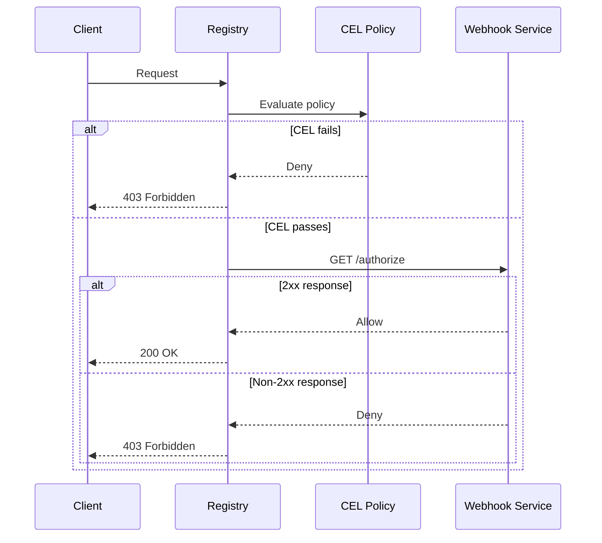

# Configure Webhook Authorization

Delegate access control decisions to an external HTTP service for maximum flexibility.

## Prerequisites

- Simple-Registry running
- External authorization service accessible via HTTP/HTTPS

## How Webhooks Work

1. Client makes a request to the registry
2. Registry sends request context to webhook via HTTP GET
3. Webhook returns 2xx to allow, any other status to deny
4. Registry proceeds or rejects based on response



---

## Basic Configuration

### Define a Webhook

```toml
[auth.webhook.my-auth]
url = "https://auth.example.com/authorize"
timeout_ms = 1000
```

### Enable Globally

```toml
[global]
authorization_webhook = "my-auth"
```

### Or Per-Repository

```toml
[repository."sensitive"]
authorization_webhook = "my-auth"
```

---

## Authentication Options

### Bearer Token

```toml
[auth.webhook.api-auth]
url = "https://api.example.com/authorize"
timeout_ms = 1000
bearer_token = "secret-api-key"
```

### Basic Authentication

```toml
[auth.webhook.basic-auth]
url = "https://service.example.com/authorize"
timeout_ms = 1000
basic_auth = { username = "webhook", password = "secret" }
```

### Mutual TLS

```toml
[auth.webhook.mtls-auth]
url = "https://secure.example.com/authorize"
timeout_ms = 1000
client_certificate_bundle = "/certs/client.pem"
client_private_key = "/certs/client-key.pem"
server_ca_bundle = "/certs/ca.pem"
```

### Combined

```toml
[auth.webhook.secure-api]
url = "https://secure-api.example.com/authorize"
timeout_ms = 1000
bearer_token = "api-key"
client_certificate_bundle = "/certs/client.pem"
client_private_key = "/certs/client-key.pem"
```

---

## Webhook Protocol

The registry sends GET requests with headers containing request context.

### Always Included

| Header               | Description           |
|----------------------|-----------------------|
| `X-Forwarded-Method` | Original HTTP method  |
| `X-Forwarded-Proto`  | Protocol (http/https) |
| `X-Forwarded-Host`   | Original Host header  |
| `X-Forwarded-Uri`    | Complete request URI  |
| `X-Forwarded-For`    | Client IP address     |

### Registry-Specific

| Header                 | Description                                       |
|------------------------|---------------------------------------------------|
| `X-Registry-Action`    | Operation type (get-manifest, put-manifest, etc.) |
| `X-Registry-Namespace` | Repository namespace                              |
| `X-Registry-Reference` | Tag or digest reference                           |
| `X-Registry-Digest`    | Blob digest                                       |

### Identity (when authenticated)

| Header                      | Description                |
|-----------------------------|----------------------------|
| `X-Registry-Username`       | Basic auth or OIDC subject |
| `X-Registry-Identity-ID`    | Identity identifier        |
| `X-Registry-Certificate-CN` | Certificate Common Name    |
| `X-Registry-Certificate-O`  | Certificate Organization   |

---

## Forward Client Headers

Pass specific client headers to the webhook:

```toml
[auth.webhook.header-aware]
url = "https://auth.example.com/authorize"
timeout_ms = 1000
forward_headers = [
  "X-Custom-Token",
  "X-Request-ID",
  "Authorization"
]
```

---

## Response Caching

Webhook responses are cached to reduce load:

```toml
[auth.webhook.cached]
url = "https://auth.example.com/authorize"
timeout_ms = 1000
cache_ttl = 60  # Cache for 60 seconds (default)
```

Disable caching:

```toml
cache_ttl = 0
```

---

## Multiple Webhooks

Configure different webhooks for different purposes:

```toml
# Standard authorization
[auth.webhook.standard]
url = "https://auth.example.com/authorize"
timeout_ms = 1000

# Enhanced for sensitive repos
[auth.webhook.enhanced]
url = "https://secure-auth.example.com/authorize"
timeout_ms = 2000
client_certificate_bundle = "/certs/client.pem"
client_private_key = "/certs/client-key.pem"

# Quota checking
[auth.webhook.quotas]
url = "http://quotas.internal:8080/check"
timeout_ms = 500

# Apply to repositories
[global]
authorization_webhook = "standard"

[repository."public"]
authorization_webhook = ""  # Disable for public

[repository."sensitive"]
authorization_webhook = "enhanced"

[repository."limited"]
authorization_webhook = "quotas"
```

---

## Example Webhook Service

Simple Python webhook:

```python
from flask import Flask, request

app = Flask(__name__)

@app.route('/authorize', methods=['GET'])
def authorize():
    action = request.headers.get('X-Registry-Action', '')
    namespace = request.headers.get('X-Registry-Namespace', '')
    username = request.headers.get('X-Registry-Username', '')

    # Allow read operations
    if action.startswith('get-') or action == 'list-tags':
        return '', 200

    # Require authentication for writes
    if not username:
        return 'Unauthorized', 401

    # Check quota, permissions, etc.
    if check_quota(username, namespace):
        return '', 200

    return 'Quota exceeded', 403

if __name__ == '__main__':
    app.run(port=8080)
```

---

## Integration with CEL Policies

Webhooks run **after** CEL policies. Use CEL for fast common rules:

```toml
# CEL handles basic checks
[global.access_policy]
default_allow = false
rules = [
  "identity.username != null"
]

# Webhook handles complex logic
[global]
authorization_webhook = "business-rules"

[auth.webhook.business-rules]
url = "https://auth.example.com/check"
timeout_ms = 2000
```

---

## Monitoring

Prometheus metrics:

```promql
# Request rate by result
rate(webhook_authorization_requests_total[5m])

# Cache hit rate
sum(rate(webhook_authorization_requests_total{result=~"cached_.*"}[5m])) /
sum(rate(webhook_authorization_requests_total[5m]))

# Webhook latency
histogram_quantile(0.95, rate(webhook_authorization_duration_seconds_bucket[5m]))
```

---

## Troubleshooting

**All requests denied:**
- Check webhook is returning 2xx
- Verify network connectivity
- Check timeout is sufficient

**Webhook not called:**
- Verify webhook name matches configuration
- Check if CEL policies deny first
- Ensure repository doesn't override with empty webhook

**Debug logging:**
```bash
RUST_LOG=simple_registry::registry::server::auth::webhook=debug \
  ./simple-registry server
```

## Reference

- [API Endpoints Reference](../reference/api-endpoints.md) - Action types
- [Metrics Reference](../reference/metrics.md) - Webhook metrics
