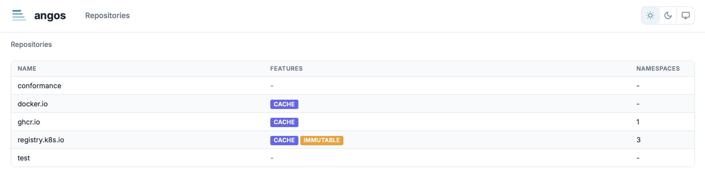
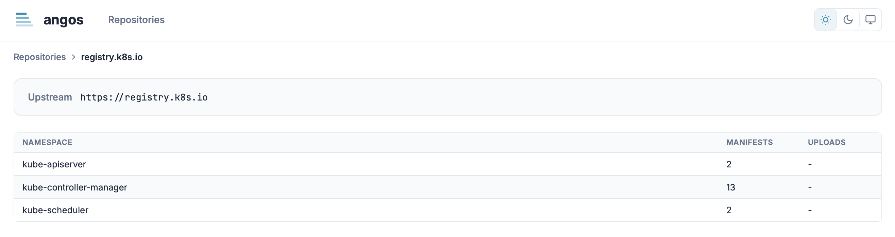
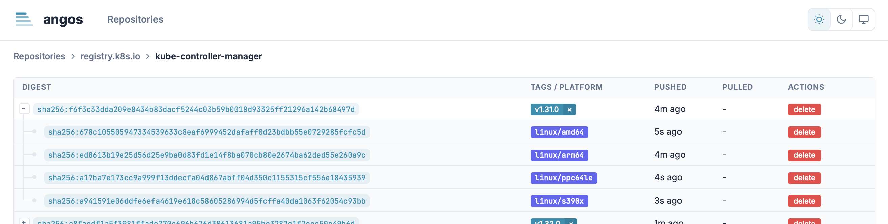
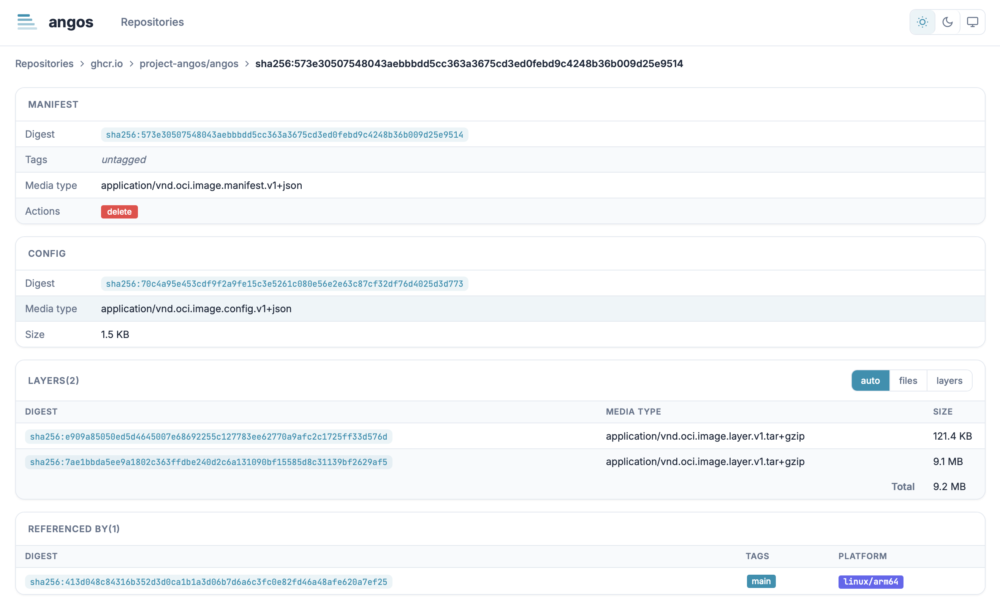
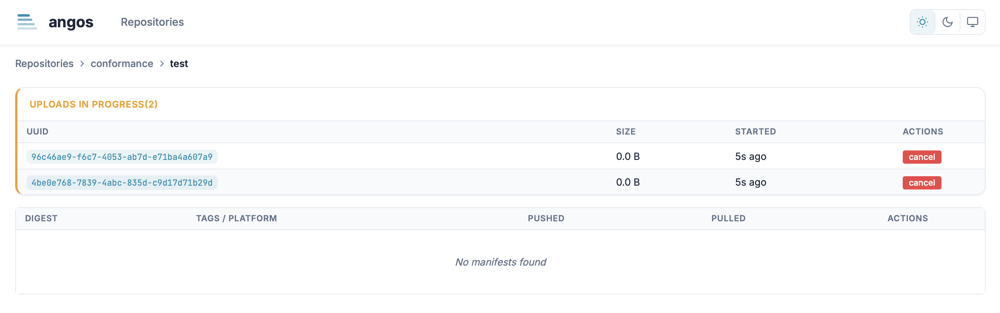
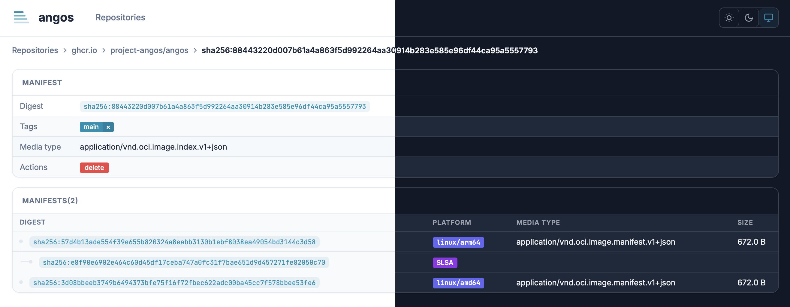
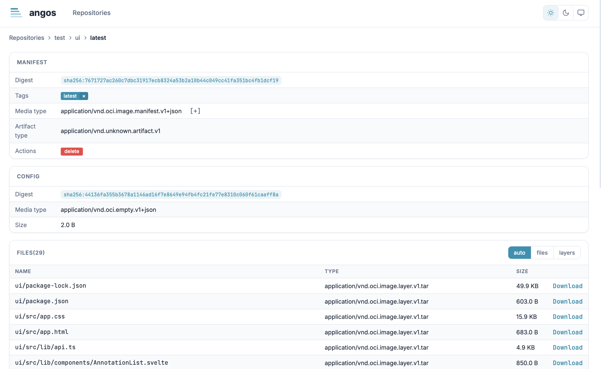

# Web UI Reference

Reference for the Angos web interface.

---

## Configuration

```toml
[ui]
enabled = true
name = "My Registry"
```

| Option    | Type   | Default             | Description                           |
|-----------|--------|---------------------|---------------------------------------|
| `enabled` | bool   | `false`             | Enable the web interface              |
| `name`    | string | `"angos"` | Registry name displayed in the header |

---

## URL Structure

URLs follow Docker reference format:

| URL                                  | View             | Description                 |
|--------------------------------------|------------------|-----------------------------|
| `/`                                  | Repository list  | All configured repositories |
| `/{repository}`                      | Namespace list   | Images within a repository  |
| `/{repository}/{namespace}`          | Manifest list    | All manifests for an image  |
| `/{repository}/{namespace}:{tag}`    | Manifest details | Manifest by tag             |
| `/{repository}/{namespace}@{digest}` | Manifest details | Manifest by digest          |

**Examples:**
- `/` - List all repositories
- `/library` - List namespaces in the "library" repository
- `/library/nginx` - List all nginx manifests
- `/library/nginx:latest` - Details for the latest tag
- `/library/nginx@sha256:abc123...` - Details for a specific digest

---

## API Endpoints

### UI Configuration

```
GET /_ui/config
```

Returns the UI configuration.

**Response:**
```json
{
  "name": "My Registry"
}
```

### Static Assets

```
GET /_ui/*
```

Serves static UI assets (JavaScript, CSS, fonts).

---

## Access Control Actions

UI-specific actions for access policies:

| Action              | Description                               |
|---------------------|-------------------------------------------|
| `ui-asset`          | Static files (JS, CSS, images)            |
| `ui-config`         | UI configuration endpoint (`/_ui/config`) |
| `list-repositories` | Repository list view                      |
| `list-namespaces`   | Namespace list view                       |
| `list-revisions`    | Manifest list view                        |
| `list-uploads`      | Active uploads view                       |

### Minimal Policy for UI Access

```toml
[global.access_policy]
default_allow = false
rules = [
  # Allow UI to load
  "request.action == 'ui-asset' || request.action == 'ui-config'",

  # Allow authenticated users to browse
  "identity.username != '' && request.action.startsWith('list-')",

  # Allow reading manifests
  "identity.username != '' && request.action == 'get-manifest'"
]
```

### Read-Only Policy

```toml
rules = [
  "request.action == 'ui-asset' || request.action == 'ui-config'",
  "identity.username != '' && request.action.startsWith('list-')",
  "identity.username != '' && request.action == 'get-manifest'",
  "identity.username != '' && request.action == 'get-blob'"
]
```

### Full Access Policy

```toml
rules = [
  "request.action == 'ui-asset' || request.action == 'ui-config'",
  "identity.username != ''"
]
```

---

## Views

### Repository List

<picture>
  <source media="(prefers-color-scheme: dark)" srcset="../images/ui-repositories-dark.png" />
  <source media="(prefers-color-scheme: light)" srcset="../images/ui-repositories-light.png" />
  
</picture>

Displays all configured repositories with:
- Repository name
- Namespace count
- Feature badges:
  - **Pull-through**: Has upstream configuration
  - **Immutable**: Immutable tags enabled

### Namespace List

<picture>
  <source media="(prefers-color-scheme: dark)" srcset="../images/ui-namespaces-dark.png" />
  <source media="(prefers-color-scheme: light)" srcset="../images/ui-namespaces-light.png" />
  
</picture>

Displays images within a repository:
- Image name (namespace)
- Manifest count
- Upload count (if any in progress)
- Repository configuration summary

### Manifest List

<picture>
  <source media="(prefers-color-scheme: dark)" srcset="../images/ui-manifests-dark.png" />
  <source media="(prefers-color-scheme: light)" srcset="../images/ui-manifests-light.png" />
  
</picture>

Tree view of all manifests:
- Multi-platform indexes with expandable children
- Platform badges (e.g., `linux/amd64`, `linux/arm64`)
- Attestations badges: SBOM, SLSA, signature, etc.
- Tags as clickable badges
- Digest (shortened, click to copy full)
- Push time
- Last pull time (if tracked)

### Manifest Details

<picture>
  <source media="(prefers-color-scheme: dark)" srcset="../images/ui-manifest-details-dark.png" />
  <source media="(prefers-color-scheme: light)" srcset="../images/ui-manifest-details-light.png" />
  
</picture>

Complete manifest information:
- **Header**: Digest, media type, size
- **Tags**: List with delete buttons
- **Layers/Children**: For images or indexes
- **Annotations**: Expandable metadata
- **Files**: For ORAS artifacts with download links
- **Referrers**: Linked signatures, SBOMs, etc.
- **Parent**: Link to parent index if applicable

### Uploads

<picture>
  <source media="(prefers-color-scheme: dark)" srcset="../images/ui-uploads-dark.png" />
  <source media="(prefers-color-scheme: light)" srcset="../images/ui-uploads-light.png" />
  
</picture>

Shows in-progress blob uploads:
- Upload UUID
- Current size
- Start time
- Cancel button

---

## Interactive Features

### Delete Operations

Delete buttons require double-click confirmation:
1. First click: Arms the button (changes to red)
2. Second click: Executes the deletion
3. Click elsewhere: Disarms

**Deletable items:**
- Tags (removes tag, keeps the manifest unless a retention policy allows its deletion)
- Manifests (by digest)
- Uploads (cancels in-progress uploads)

### Copy to Clipboard

Click on digests to copy the full value.

### Theme Toggle

Toggle between light and dark themes using the header button. Preference is saved in browser local storage.



### Annotations Expansion

Click `[+]` to expand annotation values. Well-known annotation keys are displayed with friendly names:
- `org.opencontainers.image.title` → Title
- `org.opencontainers.image.description` → Description
- `org.opencontainers.image.version` → Version
- `org.opencontainers.image.created` → Created
- `org.opencontainers.image.source` → Source

---

## ORAS Artifacts

<picture>
  <source media="(prefers-color-scheme: dark)" srcset="../images/ui-oras-files-dark.png" />
  <source media="(prefers-color-scheme: light)" srcset="../images/ui-oras-files-light.png" />
  
</picture>

For OCI artifacts (non-container content), the UI displays:
- Filename (from annotations or media type)
- Media type
- Size
- Download button

Download URL format:
```
/v2/{namespace}/blobs/{digest}
```

---

## Platform Display

Multi-platform images show platform information:

| Badge           | Meaning                |
|-----------------|------------------------|
| `linux/amd64`   | Linux on x86_64        |
| `linux/arm64`   | Linux on ARM64         |
| `linux/arm/v7`  | Linux on ARMv7         |
| `windows/amd64` | Windows on x86_64      |
| `unknown`       | Platform not specified |

---

## Error States

| State        | Display                              |
|--------------|--------------------------------------|
| Loading      | Spinner animation                    |
| Not found    | 404 message with navigation          |
| Unauthorized | Login prompt or 401 message          |
| Forbidden    | 403 message explaining access denied |
| Server error | 500 message with retry option        |

---

## Browser Requirements

- Modern browser with JavaScript enabled
- ES2020+ support (Chrome 80+, Firefox 74+, Safari 14+, Edge 80+)
- CSS Grid and Flexbox support

---

## Related

- [Enable the Web UI](../how-to/enable-web-ui.md) - Setup guide
- [Set Up Access Control](../how-to/set-up-access-control.md) - Policy configuration
- [API Endpoints Reference](api-endpoints.md) - Extension APIs used by UI
