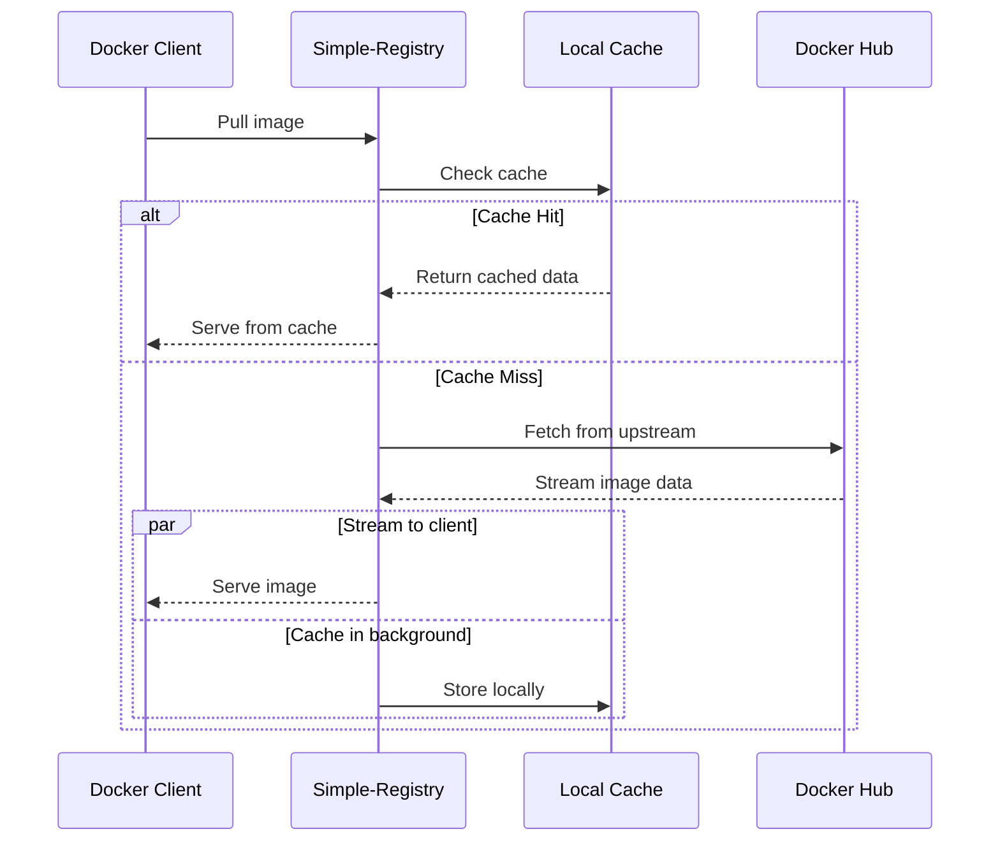

# Mirror Docker Hub

Set up Simple-Registry as a pull-through cache for Docker Hub to reduce bandwidth, improve performance, and protect against rate limits.

## What You'll Learn

By the end of this tutorial, you will:
- Configure a pull-through cache for Docker Hub
- Pull images through your local cache
- Understand how caching optimizes subsequent pulls

## Prerequisites

- Completed the [Quickstart](quickstart.md) tutorial
- Simple-Registry binary available
- Optional: Docker Hub credentials (for higher rate limits)

## Step 1: Configure the Pull-Through Cache

Create a `config.toml` with an upstream configuration:

```toml
[server]
bind_address = "0.0.0.0"
port = 5000

[blob_store.fs]
root_dir = "./registry-data"

[global.access_policy]
default_allow = true

[[repository."docker-io".upstream]]
url = "https://registry-1.docker.io"
```

The `docker-io` repository mirrors all Docker Hub images.

## Step 2: Add Authentication (Optional but Recommended)

Docker Hub has rate limits for anonymous users. Add credentials to avoid hitting limits:

```toml
[[repository."docker-io".upstream]]
url = "https://registry-1.docker.io"
username = "your-dockerhub-username"
password = "your-dockerhub-password"
```

## Step 3: Enable Immutable Tag Optimization

Add immutable tags to skip upstream checks for versioned tags.
This also reduces Docker Hub API calls, helping you stay within rate limits:

```toml
[repository."docker-io"]
immutable_tags = true
immutable_tags_exclusions = ["^latest$", "^nightly.*$"]

[[repository."docker-io".upstream]]
url = "https://registry-1.docker.io"
```

This means:
- Tags like `nginx:1.25.0` are cached permanently once pulled
- Tags like `nginx:latest` still check upstream for updates

## Step 4: Start the Registry

```bash
./simple-registry -c config.toml server
```

## Step 5: Pull Through the Cache

Configure Docker to use your registry as a mirror, or pull directly:

```bash
docker pull localhost:5000/docker-io/library/nginx:1.25.0
```

The first pull fetches from Docker Hub and caches locally. Watch the registry logs to see the upstream fetch.

## Step 6: Verify Caching

Pull the same image again:

```bash
docker rmi localhost:5000/docker-io/library/nginx:1.25.0
docker pull localhost:5000/docker-io/library/nginx:1.25.0
```

The second pull should be faster as it's served from local cache without contacting Docker Hub.

## Step 7: Check Cache Contents

If you have the Web UI enabled, browse to `http://localhost:5000` to see cached images.

Or use the API:

```bash
curl http://localhost:5000/v2/docker-io/library/nginx/tags/list
```

You should see:

```json
{"name":"docker-io/library/nginx","tags":["1.29.0"]}
```

## Complete Configuration

Here's a production-ready configuration with multiple upstreams:

```toml
[server]
bind_address = "0.0.0.0"
port = 5000

[global]
max_concurrent_cache_jobs = 8

[blob_store.fs]
root_dir = "/var/registry/data"

# Docker Hub official images
[repository."docker-io"]
immutable_tags = true
immutable_tags_exclusions = ["^latest$"]

[[repository."docker-io".upstream]]
url = "https://registry-1.docker.io"
username = "your-username"
password = "your-password"

# GitHub Container Registry
[repository."ghcr.io"]
immutable_tags = true
immutable_tags_exclusions = ["^latest$", "^main$", "^develop$"]

[[repository."ghcr.io".upstream]]
url = "https://ghcr.io"
```

## How Caching Works



1. **Cache Miss**: Registry fetches from upstream, streams to client while caching
2. **Cache Hit**: Registry serves directly from local storage
3. **Immutable Tags**: Once cached, never check upstream again
4. **Mutable Tags**: Check upstream for updates before serving

## What's Next?

- **Add more registries**: Mirror ghcr.io, quay.io, or private registries
- **Storage backends**: See [Storage Backends](../explanation/storage-backends.md) for S3 options
- **Understand caching**: See [Pull-Through Caching](../explanation/pull-through-caching.md) for details

## Reference

- [Configuration Reference](../reference/configuration.md) - All upstream options
- [Immutable Tags](../how-to/protect-tags-immutability.md) - Detailed immutability configuration
