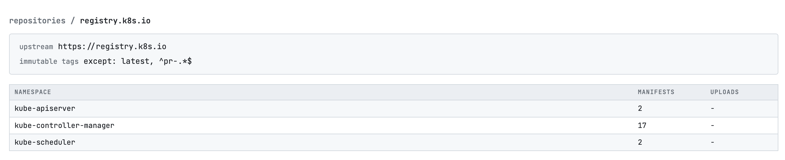
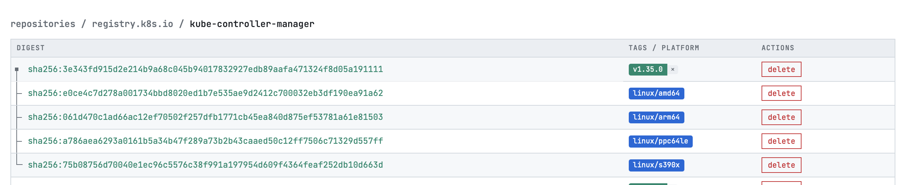
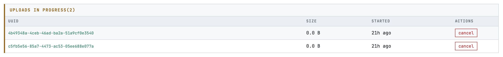
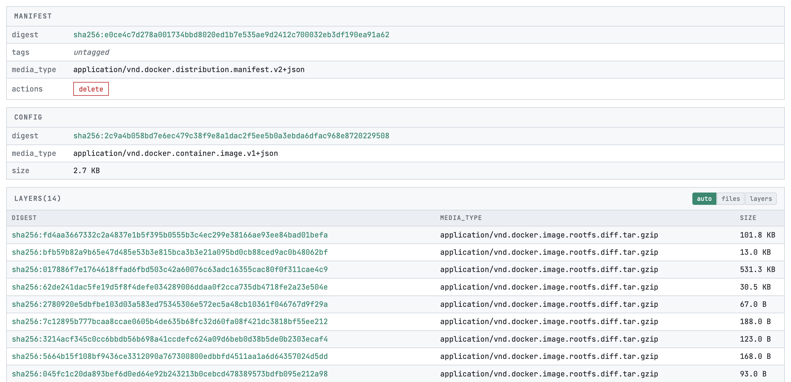
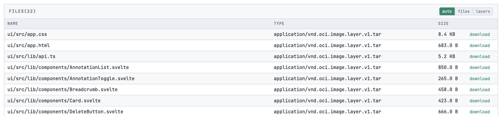
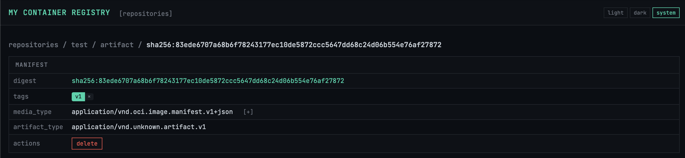

# Simple Registry UI

A web interface for browsing and managing container images stored in Simple Registry.
This UI is subject to the same authentication and authorization mechanisms as other requests.

## Navigation

The UI follows a hierarchical structure:

```
Repositories → Namespaces → Manifests → Manifest Details
```

### Repositories

The home page lists all repositories in the registry. Each repository shows:
- Repository name
- Number of namespaces
- Feature badges (pull-through cache, immutable tags)


Click a repository to view its namespaces.

### Namespaces

Shows all namespaces (image names) within a repository:
- Namespace name (displayed relative to the repository)
- Manifest count
- Active upload count

Repository configuration is displayed at the top when enabled:
- **Upstream URLs** for pull-through cache repositories
- **Immutable tags** status and exclusion patterns



Click a namespace to view its manifests.

### Manifests

Displays all manifests in a namespace with a tree structure:
- Multi-platform indexes show their child manifests indented below
- Each manifest shows its digest and tags
- Platform badges indicate architecture (e.g., linux/amd64, linux/arm64)



Click any manifest row to view its details.

Active blob uploads are shown in a warning card at the top with options to cancel them.



### Manifest Details

Shows complete information about a manifest:

- **Digest**: Content-addressable identifier
- **Tags**: All tags pointing to this manifest (deletable individually)
- **Media Type**: OCI or Docker manifest format
- **Artifact Type**: For OCI artifacts
- **Subject**: Reference to another manifest (for referrers)
- **Actions**: Delete the manifest by digest

Additional sections based on manifest type:

- **Config**: Configuration blob details
- **Layers/Files**: Image layers or artifact files
- **Manifests**: Child manifests for multi-platform indexes
- **Referenced By**: Parent manifests that include this one



## Features

### Delete Operations

Delete buttons require confirmation - click once to arm, click again to confirm, or click elsewhere to cancel.

- **Delete tag**: Removes a tag from a manifest (manifest remains if other tags exist)
- **Delete manifest**: Removes the manifest by digest
- **Cancel upload**: Aborts an in-progress blob upload

### Download Files

For ORAS artifacts, files can be downloaded directly from the manifest details page.



### View Toggle

The layers/files section offers three view modes:
- **auto**: Automatically detects ORAS artifacts and shows appropriate view
- **files**: Shows filename, type, size, and download button
- **layers**: Shows digest, media type, and size

### Annotations

Manifests, configs, and layers may have OCI annotations. Click the `[+]` button next to items with annotations to expand them. Well-known annotation keys are displayed with friendly names.

### Theme

Toggle between dark and light themes using the button in the header. The preference is saved in browser's local storage.



## URL Structure

URLs are shareable and follow this pattern:

```
/                                     # Repository list
/{repository}                         # Namespace list
/{repository}/{namespace}             # Manifest list
/{repository}/{namespace}/{reference} # Manifest details (tag or digest)
```

## Configuration

The UI is served by Simple Registry and requires no separate configuration. It reads registry data through the OCI Distribution API and extension endpoints.
